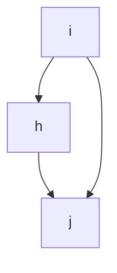

## 模型基本原理

### SAOM模型简介

SIENA(Simulation Investigation for Empirical Network Analysis)是一个统计工具,适用于分析纵向网络数据。其主要运用的是一种动态网络模型:**随机行动者导向模型**(Stochastic Actor-Oriented Model,SAOM)。为方便表述,我们通常将在SIENA中实现的SAOM称为“SIENA模型”。 

SAOM模型的主要特点是其“行动者导向”的性质,意味着模型从行动者(即网络节点)的视角来模拟变化。在网络演化中,行动者可能建立、维持或终止与其他行动者的连结。研究者通常假设，行动者的这些决策会受到网络本身的结构、行动者自身以及网络中其他行动者的特性和行为的影响。SAOM模型为我们提供了一种手段，可以量化这些因素在不同观测时期的网络演化中所起的作用及其相关的不确定性。  

SAOM模型可以被视为一个基于行动者的网络演化仿真模型。在该模型中，相邻时点的变化被称为“单元行动”（ministep），一个行动者可以创建或终止一个外向的连结。这些单元行动是依序并且基于概率进行的。通过大量的这样的单元行动,我们可以观察到从一个时间点到另一个时间点的网络演化。行动者的决策将受到当前网络状态的影响,且每一次单元行动的发生都可能改变网络的状态。这种机制使得模型能够反映出网络动态中典型的反馈过程。

### SIENA模型类型

SIENA不仅可以分析单一网络的演化,而且有多种随机行动者导向模型的变体,适用于更复杂的数据结构。这些选项的可用性取决于研究问题以及可用数据的数量和类型。本部分将简要讨论当前已实现的模型类型,以帮助研究者确定他们能够利用随机行动者导向模型进行哪种类型的分析。

适合使用RSiena进行分析的最小数据集包括在同一节点集上定义的单个网络的两次观测。在这种情况下,我们能够测试网络结构如何促进其自身的演化。然而,根据可用的数据,可能适用更多的建模选项。目前已实现的随机行动者导向模型适用于以下分析:

1. **单模网络的演化**:分析有向或无向单模网络的演化,例如一个班级中的友谊网络(Snijders, 2001)。 
2. **双模网络的演化**:分析双模网络的演化,例如一个班级中的社团成员连结:第一模式是由学生组成,第二模式是由社团组成(Koskinen和Edling, 2012)。
3. **个体行为的演化**:分析个体行为(如吸烟)的演化。
4. **单模网络、双模网络和个体行为的共演化**:分析单模网络、双模网络和个体行为的共同演化,例如友谊和吸烟,或友谊和社团成员连结的共同演化(Steglich et al., 2010; Snijders et al., 2013)。

在所有这些情况下,数据也可以包括协变量:影响动态的观察变量,但其值本身不被建模。

在前两种情况下,可以使用RSiena评估给定单模或双模网络的变化在多大程度上取决于网络结构本身和协变量。第三种选项,即模拟个体行为本身的变化,而不考虑其在网络中的嵌入性,使用较少。对于这类数据,存在许多其他的纵向建模技术。

因此,第四种模型类型已广泛应用。分析网络和行为的共同演化允许研究者解决与选择和影响过程相关的问题,例如,是否吸烟者倾向于成为朋友,或者朋友是否倾向于在吸烟习惯上变得相似。SIENA共演化模型的强大之处在于,可以同时考虑网络结构对网络演化、行为实际水平对行为变化、网络结构对行为变化、以及行为实际水平对网络演化的影响。除了网络和行为的共演化,这类随机行动者导向模型还允许对多个网络(例如友谊和建议,友谊和不喜欢,或者它们三者)的联合分析,以及有序多网络(一个网络中的联系假设另一个网络中的联系存在,例如在友谊和最好的朋友关系中)的分析。

## 研究工具准备

在进行SAOM(Stochastic Actor-Oriented Models)模型研究之前,需要设置好R环境并安装RSiena库。RSiena是一个在R环境中运行的软件包,专门用于分析SAOM模型。

```R
# 安装RSiena
install.packages("RSiena") 

# 加载RSiena库
library(RSiena)
```

## 数据准备

在使用SAOM模型前,需要把数据准备成适用于R的格式。以下是一些基本的R函数:

```R
# 读取文件中的数据为数据框
df <- read.table(file, header = TRUE, sep = ",")

# 将数据框转换为矩阵  
matrix <- as.matrix(df)

# 检查对象的类别
class(object) 

# 检查矩阵维度
dim(matrix)
```

### 网络要求

SAOM模型中对于网络主要有以下基本要求:

- **二值网络**:SAOM模型适用于二值网络,即网络连结状态为存在(1)或不存在(0)的网络。

- **至少两期**:使用SAOM模型至少需要两个时间点的观察数据。

数据集中可以包含一个或多个网络。网络可以是单模的或双模的。模态是用节点集标识的。所有单模网络必须具有相同的节点集,也称为“行动者”。如果存在一些单模网络和任何双模网络,则所有双模网络的第一个节点集应该是单模网络的节点集(行动者集)。单模网络和双模网络的选择是通过`sienaDependent()`函数中的`type`参数指定的,对于网络可以设置为`oneMode`或`bipartite`;后者表示双模网络。如果同时存在单模网络和双模依赖网络,则应该首先在`sienaDependent()`调用中指定单模网络。 

通过`sienaDependent()`进行数据规范时,必须将网络指定为矩阵、数组或稀疏矩阵三元组列表的形式。`sienaDependent()`的帮助页面有使用稀疏矩阵作为输入的示例。

对于通过`sienaDataCreateFromSession()`函数规范的数据,允许使用的数据类型是边列表格式、Pajek程序格式和Siena格式的原始边列表。对于节点数量较多(比如大于100)的网络,边列表格式在计算机内存使用上更高效。

请注意,`sienaDataCreateFromSession()`仅在RSienaTest中可用。

与Pajek或Siena格式相比,稀疏矩阵(可通过`sienaDependent`输入使用)对于运行估计具有相同的效率。三种可能的网络输入格式如下:

1. **邻接矩阵**

   这些可以在`sienaDependent`和`sienaDataCreateFromSession`中使用。

   在常规的单模网络情况下,邻接矩阵以`n`行和`n`列的矩阵形式给出,包含整数。对角线的值无意义,但必须存在。在双模网络(即具有两个节点集的网络,所有连结在第一个和第二个节点集之间)的情况下,矩阵不必是正方形的,因为第一个集合中的节点数通常不会等于第二个集合中的节点数;而且如果矩阵是正方形的,对角线仍然是有意义的。

   尽管本节只讨论有向图,但对于单模网络,如果所有观察到的邻接矩阵都是对称的,也可以指定无向网络。这将由SIENA自动检测,然后程序将采用非定向网络的方法。

   连结的值必须为0、1或NA(不可用=缺失);或者是预设值10或11(见下文)。

   `sienaDependent`的帮助页面通过示例展示了如何使用稀疏矩阵进行规范。

2. **Pajek格式** 

   这些可以在`sienaDataCreateFromSession`中使用(仅在RSienaTest中可用)。

   如果有向图数据文件的扩展名是`.net`,则程序假定数据文件具有Pajek格式。文件应该只与一个观察相关,并且应该包含一个顶点列表(使用关键字`*Vertices`,以及一个弧列表,使用关键字`*Arcs`后面跟随按Pajek规则的数据行。这些关键词必须在不包含其他字符的行中。`s50`数据集的`examples`目录中分发的示例输入文件演示了这种格式。

3. **Siena格式**

   这些可以在`sienaDataCreateFromSession`中使用(仅在RSienaTest中可用)。

   边列表是一个包含三列或四列的矩阵:起点、终点、权重、迭代(可选)。

   与Pajek格式一样,这种格式的优点是不存在的连结(权重为0的连结)不需要在数据矩阵中提及。通过在Siena格式的第四列中指定迭代,可以使用一个矩阵包含所有迭代的数据。

   缺失值必须以R中常用的方式表示,即NA。

## 变量设定

### 因变量设定

#### 网络因变量设定

|        t1         |        t2         |                           |
| :---------------: | :---------------: | :-----------------------: |
| i &nbsp; &nbsp; j |      i -> j       |     creation of a tie     |
|      i -> j       |      i -> j       |   maintenance of a tie    |
|      i -> j       | i &nbsp; &nbsp; j |   termination of a tie    |
| i &nbsp; &nbsp; j | i &nbsp; &nbsp; j | maintenance of a ‘no-tie’ |


对于一个二值网络的两次观测,单个网络连结变量可以有四种模式,如上表所示。在SAOM模型中,连结的变化被定义为三种方式:

- 创建(creation):建立先前不存在的连结  
- 维持(endowment):维持现有连结
- 评估(evaluation):不区分创建或维持,仅评估连结的存在

这三个可能的连结变化值构成了网络演化模型的因变量(除此之外,还有速率函数)。模型化创建、维持或存在网络连结的概率(更准确地说,它们是对数概率的线性预测器的组成部分)作为因变量,构成不同的效应(effect)。下表可以帮助理解每种情况下概率是如何参照的:比较绿色情况的概率和蓝色情况的概率。


它们通过三个函数在RSiena中进行建模:

```R
# 评估函数
my_model <- setEffect(my_model, effectName = "evaluation", ...)
 
# 创建函数 
my_model <- setEffect(my_model, effectName = "creation", ...)

# 维持函数
my_model <- setEffect(my_model, effectName = "endowment", ...)
```

这些函数取决于行动者以及网络、行为和协变量的状态由某些效应的加权和构成,这些效应定义了决定网络和行为的变化概率特征。

* **速率函数**:速率函数模型化了因变量改变的速度,即每个网络行动者获得改变其因变量得分机会的速度。

* **评估函数**:评估函数是变化概率的主要决定因素。向评估函数值更高的状态移动的概率更高。另外一种表示方法是,评估函数建模行动者对其局部网络邻域配置的“满意度”。即假设行动者改变其因变量得分,使其总体满意度提高——带有一个随机元素来表示行为的有限可预测性。

* **创造函数**:创造函数在评估可能的网络变化时区分新老网络连结,在评估可能的行为变化时区分增加或减少行为值。它仅对向上变化的概率是变化的组成部分:连结的创建,也就是行为因变量值的增大。

  创造效应可以是评估效应的创造部分,也可以是基本效应。

  使用满意度的解释方法,创造函数建模创造网络连结或增加行为得分时产生的满意度增加。

* **禀赋或维持函数**:禀赋函数,也可称为维持函数,在评估可能的网络变化时也区分新老网络连结,在评估可能的行为变化时区分增加或减少行为值。

  它也仅对向下变化的概率是变化的组成部分:现有连结的维持与终止,行为变量值的减少。

  同样,禀赋效应可以是评估效应的维持部分,也可以是基本效应。

  使用满意度的解释方法,禀赋函数对解散网络连结或减少行为得分时导致的满意度损失进行建模(因此使用“禀赋”这个标签)。

  创造、评估和禀赋效应可以作为一个模型中出现一个或两个作为模型函数的组成部分,但不能所有三个中都出现再一个模型函数中(这将导致完全共线)。每个效应的估计参数应被解释为对数概率比(类似于来自逻辑回归的对数优势比;因为这里的选择是多项的而不是二元的,所以正确的术语是概率比)。从实践的角度看,除非人们对分析的数据集中的连结创建和维持可能怎样有一个清晰的想法,否则开始建模时使用评估效应是更便利的。如果一个给定的效应对连结的创建和维持同样强烈,将一个效应的贡献分解为两个函数需要更多的数据,那么统计效力将由于这种分解而减小。出于这些原因,大多数研究将他们的注意力放在在评估效应上。

### 协变量设定

SAOM模型允许加入不同类型的协变量来控制网络或行为变化中的其他因素。协变量是影响网络或行为动态但本身不被建模的观察变量。协变量可以是一元或二元,不变或变化的:

* 一元协变量vs二元协变量:一元协变量描述行动者的特征,二元协变量描述行动者对之间的连结。
* 不变协变量vs变化协变量:不变协变量在观测时期保持恒定,变化协变量在不同观测时期发生变化。 
* 网络协变量:描述整个网络拓扑结构性质的协变量,例如网络密度、平均路径长度等。

通过加入不同类型的协变量,研究者可以区分网络结构效应和协变量效应对网络或行为变化的影响,得到更准确的模型结果。

#### 行为体绑定协变量

行为体绑定变量(也称为一元协变量)是通过`coCovar()`函数(如果它们随时间常量)和`varCovar()`函数(如果它们随时间变化)定义的。

每个恒定的行为体绑定协变量对所有观察时刻都有每个行动者一个值,并且具有自变量的作用。

变化的变量可以在观测时刻之间改变;这时它们称为“变化的行为体绑定协变量”,也具有自变量的作用。

SIENA的内部操作不依赖于变量的量表。建议对协变量进行缩放,使其标准偏差在0.1到10之间。

变化的行为体绑定协变量被假定在两个观察之间保持不变的值。如果网络的观测时刻为$t_1、t_2、...、t_M$,则变化的协变量参考$M-1$个时刻$t_1$至$t_{M-1}$,并且变化协变量的第$m$个值被假定在时刻$t_m$到$t_{m+1}$期间有效。$t_M$时刻(最后时刻)的价值不起作用。只有在存在3个或更多观测时刻的情况下,变化的协变量作为自变量才有意义,因为对于2个观测时刻,恒定和变化的协变量的区别没有意义。

每个变化的行为体绑定协变量必须在对`varCovar()`的单独调用中指定,使用$n\times (M-1)$矩阵作为输入,其中列对应于$M-1$个观测之间的时期。

默认情况下,均值从协变量中减去。这可以通过构造带有关键字`centered=FALSE`的协变量来关闭。中心化协变量改进了估计算法的收敛性。因此,建议使用默认值(中心化),除非有理由使用非中心化协变量,例如在效应中用作权重(如对于inPopX效应)。可以将给定的行动者变量以中心化和非中心化的版本都包含在SIENA数据集中,并仅在需要适当的效应定义时使用非中心化版本。请参阅关于中心化的部分。

#### 二元协变量

与网络数据一样,每个二元协变量的测量也必须包含在单独的矩阵中。对于单模数据,这是一个正方形的数据矩阵,对角线值无意义。

区分恒定和变化的二元协变量,其中变化指随时间变化。每个恒定的协变量对每个行动者对都有一个对所有观察时刻均有效的值,并且具有自变量的作用。另一方面,变化的协变量在观测之间的每个时期都有这样一个值。如果网络数据有$M$个迭代(即观察时刻),则这涵盖了$M-1$个时期,因此,为指定单个变化的单模二元协变量,需要$n \times n \times (M-1)$的数组。

双模二元协变量也是可能的;请参阅`coDyadCovar`和`varDyadCovar`的帮助页面。 

SIENA的内部操作不依赖于量表。建议对协变量进行缩放,使其标准偏差在0.1到10之间。

与单体协变量一样,假定变化的二元协变量在两个观察时刻之间保持常数值。如果网络的观测时刻为$t_1、t_2、...、t_M$,则变化的协变量参考$M-1$时刻$t_1$至$t_{M-1}$,并且变化协变量的第$m$个值被假定在时刻$t_m$到$t_{m+1}$期间有效。$t_M$时刻(最后时刻)的值不起作用。

使用`coDyadCovar`函数指定恒定二元协变量,使用`varDyadCovar`指定变化的二元协变量。

#### 协变量的内部处理

##### 协变量的交互作用和二元变换

对于行为体绑定变量(也称为单体变量),SIENA内部通过相应效应的定义将其转化为两种二元协变量。设行为体绑定变量为$v_i$,二元组中的两个行为体为$i$ 和 $j$。假设$v_i$ 的范围(即最高值和最低值的差值)给定为$r_V$。两种变换如下:

1. 二元相似度定义为:

   $$sim_{ij}^V = 1 - \frac{|v_i - v_j|}{r_V}$$

   如果两个行为体具有相同的值,则此相似度测量为1;如果一个具有最高可能值,另一个具有最低可能值,则为0。对于各种相似性效应,此测量通过减去所有二元组的均值进行中心化,因此此相似性变量的均值变为0。

   此相似度测量的优点是其系数在某种意义上是可比较的,即测量总是在0和1之间变化。

2. 相同的$V$定义为:

   $$same_{ij}^V = \begin{cases}
            1, & \text{if } v_i = v_j\\
            0, & \text{if } v_i \neq v_j
          \end{cases}$$
          
   这也可以称为相对于$V$的二元同一性。

二元相似度适用于可以视为区间级变量的协变量;二元同一性适用于分类变量。

此外,SIENA提供了用户自定义的协变量之间的两变量和三变量交互的可能性。

##### 中心化(去均值)

行为体绑定变量和二元协变量都可以通过程序以下方式中心化。

对于行为体绑定变量,均值由`sienaDataCreate`函数减去。然后存储中心化的值,所有计算都使用这些中心化变量。对于变化的变量,使用的均值是全局均值(在所有时期上平均)。这些被减去的均值在`print01Report`的输出中报告。对于多组选项(第11.2节),被减去的值是所有组的全局均值。

每个变化的行为体绑定协变量必须在对`varCovar()`的单独调用中指定,使用$n\times (M-1)$矩阵作为输入,其中列对应于$M-1$个观测之间的时期。

默认情况下,均值从协变量中减去。这可以通过构造带有关键字`centered=FALSE`的协变量来关闭。中心化协变量改进了估计算法的收敛性。因此,建议使用默认值(中心化),除非有理由使用非中心化协变量,例如在效应中用作权重(例如,对于inPopX效应)。可以将给定的行动者变量以中心化和非中心化的版本都包含在SIENA数据集中,并仅在需要适当的效应定义时使用非中心化版本。

对于二元协变量和从行为体绑定变量派生的相似性变量,`sienaDataCreate`函数计算并存储全部均值;存储的变量值不中心化,但在程序计算期间从中减去均值。 (因此,与行为体绑定变量不同,程序内部以不同方式处理二元协变量,意味着在不同时刻减去均值,但效果相同;多组数据集除外,参见下文。) 与“协变量相似性”效应不同,“相同协变量”效应不中心化,而保持其0-1值。

对于多组选项(第11.2节),二元协变量与行为体绑定变量的处理不同:在多组数据集的二元协变量中,中心化是通过组内均值完成的;多组数据集的行为体绑定变量通过`sienaGroupCreate`中心化于总体均值。

协变量的均值存储为`sienaDataCreate`创建的对象的属性。可以通过对象查看均值信息。

依赖行为变量的中心化在内部模拟期间完成,其均值不存储在SIENA数据集中,但存储在依赖变量的属性中。可以通过相关函数计算依赖变量的均值。

对于由`sienaGroupCreate`构造的多组数据集,属性“vCovarMean”包含行为体绑定变量的总体均值。

此外,`sienaComposition()`处理组合变化,`sienaDataCreate()`组合各数据源,`sienaGroupCreate()`定义群组结构。

### 进一步的数据规范

#### 结构决定值

允许图中的某些值是结构决定的,即确定性的而不是随机的。这与列联表中“结构零”的现象类似,但在SIENA中不仅允许结构零,还允许结构一。

结构零和结构一可以在输入数据中分别使用预留代码10和11指定。它们可以在不同时间点有所不同。 

结构零提供了一种简单的方法来处理行动者在观测之间加入或离开网络的情况:在行动者不在场时,将其所有入度和出度连结变量指定为结构零。

当模型中包括了赋值或创建效应时,不应该使用变化的结构值。

#### 缺失数据

SIENA允许网络变量、协变量和依赖行为变量存在缺失数据,用NA表示。

缺失数据被视为非信息性的。缺失数据比例低于10%的情况下通常不会造成太多困难,前提是缺失是非信息性的。

为了进行有意义的模拟,缺失值会被填充。在参数估计中,含有缺失的连结变量和行为体变量不会用于计算目标统计量。

- 在初始观测中,缺失条目被设置为0(无连结)。

- 在后续观测中,如果存在上一观测值则沿用,否则填充为0。

- 对于协变量,默认用变量的全局均值填充。 

- 填充值在模拟中可以改变。

- 统计量仅使用非缺失数据。

#### 结构变化:加入者和离开者

行动者因加入或离开导致的网络结构变化是通过Huisman和Snijders (2003)的“加入者和离开者”方法处理的。

数据矩阵必须包含所有时点存在的行动者。对于行动者不在场的迭代:

- 邻接矩阵条目可以是NA(视为0或上一值)或有效代码。

- 加入/离开时间由`sienaCompositionChange`或`sienaCompositionChangeFromFile`指定。

```R
# 示例
comp <- rep(list(c(1,6)), 50) 
comp[[11]] <- c(3,6)
comp[[20]] <- c(1,4) 
comp[[33]] <- c(1.5,3, 4.01,6)
changes <- sienaCompositionChange(comp)
```

- 需要无条件估计。

- 不能与`sienaGOF`联合使用。  

- 使用NA代码使`sienaGOF`起作用。

- 与赋值/创建效应不兼容;应使用本方法而非结构零。

## 模型设定

定义数据之后,下一步是模型的设定,涉及选择影响网络和行为变化的效应。

并非所有变化概率的贡献都可以写成某些基本函数(评估函数)的变化。因此,有时我们需要直接表示对连结变化或行为变化的贡献,而不借助评估函数,这通过使用基础效应来实现。(Snijders, 2001中称之为满意函数;作为更中性的术语,我们现在使用“基础效应”一词。)

### 基础效应

以传递闭包为例,它可以表示为行动者倾向于形成封闭三元组,如下图所示。当我们聚焦于行动者i时,如果上一个时点已经具有了i -> j和h -> j的连结,那么这个时点行动者i就可能更倾向于与行为者h形成连结(h对第三个行为者j作出相同的出度选择)。这个过程中,对应的评估效应是趋向于形成封闭三元组的transTrip效应,它由两个不同的基础效应transTrip1(促进创建或维护i -> j连结)和transTrip2(促进i -> h连结)组成。



基础效应是直接定义的,不需要基于某个评估函数的变化进行表述。这意味着基础效应比评估效应更为普遍,所有的效应都可以被表示为基础效应。然而,为了方便理解,我们尽可能的使用评估函数来表述效应。

基础效应可以适用于连结的创建和维护,也可以只适用于连结的创建或者维持。在RSiena中,基本效应和评估效应之间的区别仅在于内部编程代码,effects对象中指定的效应类型以及includeEffects和setEffect等函数中的可能取值仅为eval、creat和endow。在RSiena这个软件中,基础效应和评估效应的区别主要在于内部编程代码,而效应的类型可能是eval(评估)、creat(创建)和endow(维持)。

在SAOM模型中,每个效应都对应一个指标(statistic),这个指标测量了某个特定网络配置的存在程度。每个效应的值都是根据这个指标和一个参数(也就是系数)的乘积来计算的。

### 数学规范

以下给出了模型的数学定义以准确解释上述直观说明。为了简化记号,我们从公式中省略了所有的统计参数。为了保持本节的简洁,我们不会给出大量的解释,而是引用相关文献。

首先考虑网络动态。在任何给定的时刻,设网络被表示为$x_0$。行动者$i$ 的速率函数表示为$\lambda_i(x)$;评价函数表示为$f_i(x)$;创建函数表示为$c_i(x)$;禀赋函数表示为$e_i(x)$。

在任何给定的时刻,设当前网络表示为$x_0$。改变的下一个机会出现的时间长度以参数$\lambda^+(x_0) = \sum_i \lambda_i(x_0)$ 指数分布。这意味着期望的时间长度为$\frac{1}{\lambda^+(x_0)}$。行动者$i$ 成为下一个有改变机会的可能性是$\frac{\lambda_i(x_0)}{\lambda^+(x_0)}$。

假设行动者$i$ 是下一个有改变机会的人,也可以说,这是关注的行动者。然后行动者$i$ 有改变一个网络连结或保持网络状态不变的可能性。用$C$ 表示所有可以作为结果获得的网络集合。然后这一步得到的网络的概率取决于称为目标函数的$u_i(x_0, x)$,稍后我们将定义这个函数。假设$x \in C$ 是可以作为最小步骤结果获得的某个网络;那么$x$ 将与$x_0$ 相同,除了可能存在于$x$ 但不存在于$x_0$ 的连结$i \rightarrow j$,反之亦然。下一个网络是$x$ 的概率由下式给出:

$$P(x|x_0) = \frac{\exp(u_i(x_0, x))}{\sum_{x' \in C} \exp(u_i(x_0, x'))}$$

分子是为了让这一步的所有概率之和为1。 

目标函数定义如下。如果只有评价函数(数学上,这意味着创建函数和禀赋函数都为0),那么目标函数等于新状态的评价函数,$u_i(x_0, x) = f_i(x)$。由于指数函数的特性,我们同样可以将目标函数定义为评价函数的增益,$u_i(x_0, x) = f_i(x) - f_i(x_0)$。

定义一般情况时,注意如果$x_0$和$x$不同,那么它们只在一个连结变量$x_{ij}$上不同。定义$\Delta^+(x_0, x) = 1$ 如果$x$的连结比$x_0$多一个,意味着这个改变创建了一个连结,否则$\Delta^+(x_0, x) = 0$。类似地,定义$\Delta^-(x_0, x) = 1$ 如果$x$的连结比$x_0$少一个,意味着这个改变解除了一个连结,否则$\Delta^-(x_0, x) = 0$。然后目标函数的一般定义是:

$$u_i(x_0, x) = f_i(x) - f_i(x_0) + \Delta^+(x_0, x)(c_i(x) - c_i(x_0)) + \Delta^-(x_0, x)(e_i(x) - e_i(x_0))$$

这表明,如果创建了一个连结($\Delta^+(x_0, x) = 1$),创建函数的改变才起作用;如果解除了一个连结($\Delta^-(x_0, x) = 1$),禀赋函数的改变才起作用。

如果也包括基本效应,那么将一般的(评价类型)基本效应的线性组合表示为$f_{el_{ij}}(x)$,创建基本效应表示为$c_{el_{ij}}(x)$,禀赋基本效应表示为$e_{el_{ij}}(x)$。然后我们还需要将$f_{el_{ij}}(x) + \Delta^+(x_0, x) c_{el_{ij}}(x) + \Delta^-(x_0, x) e_{el_{ij}}(x)$加到目标函数$u_i(x_0, x)$中。

对于行为动态,定义与之相似。这里的基本假设是,当有改变的机会时,行为变量的可能新值是当前值,当前值+1,或当前值-1,只要这些改变不会使值超出允许的范围。更详细的解释参见(Snijders et al., 2007, 2010b; Steglich et al., 2010; Veenstra et al., 2013)。

评价函数、创建函数和禀赋函数都是由效应的线性组合构造的:
$$f_i(x) = \sum_k \beta_k s_{ik}(x)$$
其中,$\beta_k$是参数,$s_{ik}(x)$是效应。对于具有多个因变量(网络、行为)的模型,这是特定于每个因变量的;例如,在一个既包含网络又包含行为的研究中,有一个网络和一个行为变量时,就会有两个评价函数。

对于网络效应,公式(4)所表示的关键是差值: 
$$
\Delta_{kij}(x) = s_{ki}(x + _{ij}) - s_{ki}(x - _{ij})
$$
其中,$x + _{ij}$是包含连结$i \rightarrow j$ 的网络$x$,$x - _{ij}$是去除该连结的网络$x$。这被称为变化统计量。 

基本效应定义为:
$$
s_{el_{ijk}}(x) = x_{ij} s_{el_{ijk}^0}(x)  
$$
对于一个不依赖于$x_{ij}$ 的统计量$s_{el_{ijk}^0}(x)$。因此,相应的变化统计量是:
$$
\Delta_{el_{kij}}(x) = s_{el_{ijk}^0}(x)
$$
这个公式阐述了,在给定的网络状态$x$下,改变某个特定的连结$i \rightarrow j$ 将会如何改变基本效应。

对于行为动态,定义类似。这里的基本假设是,当有改变的机会时,行为变量的可能新值是当前值,当前值+1,或当前值-1,只要这些改变不会使值超出允许的范围。更详细的解释参见(Snijders et al., 2007, 2010b; Steglich et al., 2010; Veenstra et al., 2013)。

评价函数、创建函数和禀赋函数都是由效应的线性组合构造的:
$$f_i(x) = \sum_k \beta_k s_{ik}(x)$$
其中,$\beta_k$是参数,$s_{ik}(x)$是效应。对于具有多个因变量(网络、行为)的模型,这是特定于每个因变量的;例如,在一个既包含网络又包含行为的研究中,有一个网络和一个行为变量时,就会有两个评价函数。

对于网络效应,公式(4)所表示的关键是差值: 
$$
\Delta_{kij}(x) = s_{ki}(x + _{ij}) - s_{ki}(x - _{ij})
$$
其中,$x + _{ij}$是包含连结$i \rightarrow j$ 的网络$x$,$x - _{ij}$是去除该连结的网络$x$。这被称为变化统计量。 

基本效应定义为:
$$
s_{el_{ijk}}(x) = x_{ij} s_{el_{ijk}^0}(x)  
$$
对于一个不依赖于$x_{ij}$ 的统计量$s_{el_{ijk}^0}(x)$。因此,相应的变化统计量是:
$$
\Delta_{el_{kij}}(x) = s_{el_{ijk}^0}(x)
$$
这个公式阐述了,在给定的网络状态$x$下,改变某个特定的连结$i \rightarrow j$ 将会如何改变基本效应。

### 简要数学规范

对于总的网络效应(将不同的网络结构指标作为因变量),根据以下公式计算:
$$
f^{\text{net}}_i(x) = \sum_{k} \beta^{\text{net}}_k s^{\text{net}}_{\text{ik}}(x)
$$

其中,$f^{\text{net}}_i(x)$ 是行动者$i$ 的网络效应函数,$\beta^{\text{net}}_k$ 是效应$k$ 的参数,$s^{\text{net}}_{\text{ik}}(x)$ 是效应$k$ 的指标。参数$\beta^{\text{net}}_k$ 是模型的一部分,需要通过模型估计来确定。而指标$s^{\text{net}}_{\text{ik}}(x)$ 则是根据网络数据$x$ 来计算的。

对于行为效应(将行动者的不同行为指标作为因变量),公式如下:
$$
f^{\text{beh}}_i(x, z) = \sum_{k} \beta^{\text{beh}}_k s^{\text{beh}}_{\text{ik}}(x, z)
$$

其中,$f^{\text{beh}}_i(x, z)$ 是行动者$i$ 的行为效应函数,$\beta^{\text{beh}}_k$ 是效应$k$ 的参数,$s^{\text{beh}}_{\text{ik}}(x, z)$ 是效应$k$ 的指标。参数$\beta^{\text{beh}}_k$ 是模型的一部分,需要通过模型估计来确定。而指标$s^{\text{beh}}_{\text{ik}}(x, z)$ 则是根据网络数据$x$ 和行为数据$z$ 来计算的。

每个效应的参数通过模型估计来确定,具体来说,参数估计的目标是最大化观察数据的对数似然(可以选择其他的估计方法)。对于单个连结变化的对数概率,可以通过以下公式表示:
$$
f_{\text{ij}}(\beta, s) = \sum_{k=1}^K \beta_k s_{\text{kij}} + \epsilon_{\text{ij}}  
$$

其中,$f_{\text{ij}}(\beta, s)$ 是连结$i \rightarrow j$ 的对数概率,$\beta_k$ 是效应$k$ 的参数,$s_{\text{kij}}$ 是效应$k$ 的指标,$\epsilon_{\text{ij}}$ 是一个误差项。

对于行动者$i$ 选择行动者$j$ 作为网络连结的概率,则可以通过以下公式表示:
$$
Pr_{ij} = \dfrac{\exp\left(\sum_{k=1}^K \beta_k s_{kij}\right)}{\sum_{h=1}^J \exp\left(\sum_{k=1}^K \beta_k s_{kih}\right)}
$$

其中,$Pr_{ij}$ 是行动者$i$ 选择行动者$j$ 的概率,$\beta_k$ 是效应$k$ 的参数,$s_{\text{kij}}$ 是效应$k$ 的指标。参数$\beta_k$ 是模型的一部分,需要通过模型估计来确定。

这些公式提供了一个框架,可以在这个框架中定义和计算各种网络和行为效应。具体的效应和指标的选择取决于研究的目标和问题。

### 效应设定

在RSiena中,我们使用效应对象来定义模型的数据规范。一般而言,效应对象是一个属于`sienaEffects`类的对象,在处理多组模型的情况下(稍后我们会讨论这个主题),它属于`sienaGroupEffects`类。它其实是一种特殊类型的数据框架。函数`getEffects`最初创建了效应对象,然后我们可以使用函数`includeEffects`、`setEffects`等来修改效应对象。其中一个关键组成部分是每个效应的`shortName`,这是数据框架中的一列,用于标识效应。在实际使用SIENA时,`shortNames`极为重要。

`shortName`本身并未指定协变量,因此除了需要`shortName`,效应的协变量(以及其他作为效应的解释变量的因变量)还需要协变量的名称。如果有多个因变量(网络和/或行为),则指定效应还需要因变量的名称(`name`),这将在效应对象的`interaction1`(等)列中给出。 

我们可以通过效应的`type`来指定评估效应(`eval`)、禀赋效应(`endow`)和创造效应(`creation`),其默认值是`eval`。对于速率效应,其类型为`rate`,我们可以在函数`includeEffects`、`setEffect`和`includeInteraction`中设置类型。

你可以使用`effectsDocumentation()`函数在浏览器中显示当前版本RSiena中所有可用效应的列表及其shortNames。

例如,给定效应对象(例如`myeff`)的所有可用效应的列表可以通过下列函数调用在浏览器中显示:

```R
effectsDocumentation(myeff)
```

若要列出`myeff`对象中的前20个效应,可以运行:

```R
head(cbind(myeff$effectName, myeff$type, myeff$shortName), 20) 
```

作为另一个例子,要列出`myeff`中的所有评估效应,可以运行:

```R
cbind(myeff$effectName, myeff$type, myeff$shortName)[myeff$type == "eval",]
```

而要获取`myeff`中的所有`shortNames`集合,可以运行:

```R  
unique(myeff$shortName)
```

简单来说,选择影响网络和行为变化的效应需要以下三个步骤:

1. **选择效应**

   使用`getEffects()`可以查看RSiena支持的所有内置效应。

   使用`includeEffects()`可以选择加入模型的效应。`includeEffects()`主要参数:

   - `sienaModel`:SIENA模型对象

   - `effectsToInclude`:字符向量,指定效应名称

   - `behaviors`:是否为行为效应,默认FALSE

   - `layers`:用于选择层次效应的层

   - `period`:用于选择不同时期的效应 

   - `formation` :用于选择网络形成效应

   - `rate`:用于选择率效应

   - `maxAlter`:最大选择边数,用于截断效应

   示例:

   ```R
   # 为my_model选择两个网络效应   
   my_model <- includeEffects(my_model, effectsToInclude=c("outDegree","reciprocity"))
   
   # 为my_model选择三个行为效应
   my_model <- includeEffects(my_model, effectsToInclude=c("linearShape","quadraticShape","interaction"), behaviors=TRUE)
   ```

2. **设置效应参数**

   使用`setEffect()`可以修改或添加效应的参数。`setEffect()`主要参数:

   - `sienaModel`:SIENA模型对象

   - `effectName`:效应名称

   - `behavior`:是否为行为效应,默认FALSE

   - `parameters`:数字向量,设置效应参数

   - `period`:设置特定时期的效应参数

   - `formation`:设置网络形成效应参数

   - `verbose`:是否打印详细信息

   示例:

   ```R    
   # 为"outDegree"网络效应设置参数0.2
   my_model <- setEffect(my_model, "outDegree", 0.2)    
   
   # 为"linearShape"行为效应设置参数1.5 
   my_model <- setEffect(my_model, effectName="linearShape", behavior=TRUE, 1.5)
   ```

3. **添加交互效应**

   使用`includeInteraction()`在模型中加入交互效应。`includeInteraction()`主要参数:

   - `sienaModel`:SIENA模型对象
- `interaction`:交互效应名称

   - `nestedIn`:交互效应嵌套的效应名称

   - `period`:添加特定时期的交互效应

   - `formation`:添加网络形成的交互效应

   示例:

   ```R
   # 添加两个网络效应的交互效应
   my_model <- includeInteraction(my_model, interaction="outDegree_X_reciprocity")
   
   # 添加一个行为效应的二次项
   my_model <- includeInteraction(my_model, interaction="quadraticShape", nestedIn="linearShape", behavior=TRUE)
   ```

## 模型估计

模型参数在模型设定完成后进行估计,使用迭代的随机近似算法。实现了四种估计算法:矩方法('MoM';Snijders, 2001;Snijders et al., 2007);广义矩方法('GMoM';Amati et al., 2015, 2019);最大似然法('ML';Snijders et al., 2010a);以及贝叶斯方法(Koskinen, 2004;Koskinen and Snijders, 2007;Schweinberger and Snijders, 2007a)。

在本章中,参数的数量用$p$表示。算法基于不断重复模拟网络的演化过程进行。这些重复被称为'runs'。MoM估计算法将观察到的网络(从数据文件获得)与模拟生成的假设网络进行比较,从而进行参数估计。 

估计算法具有随机性质,因此每次的结果可能会有所变化。对于数据集和模型的良好匹配组合,不同试验中获得的估计结果将非常相似。所以对于将在论文或演示文稿中报告的模型,最好至少重复一次估计过程,以确保模型结果的稳健。如果希望在不同的估计中得到相同的结果,可以设置随机数种子实现。

### SIENA估计过程概述

SIENA中的估计过程在`siena07()`和`sienacpp()`(彼此的替代方法)函数中实现,使用由`sienaAlgorithmCreate()`定义的算法规范。

估计从参数的初始值开始,`siena07()`和`sienacpp()`返回一个`sienaFit`对象,其中包含估计值及标准误差以及额外信息。由于估计过程是迭代的(依赖于初始值)且随机的,结果并不总是得到良好的收敛。对于收敛性的检查的方法,我们会进行讨论。

下面的许多内容与`siena07()`相关,但也适用于`sienacpp()`。不同之处在于,`sienacpp`的估计完全保持在SIENA的'后端' C++部分,而`siena07()`在C++中进行模拟,但在R '前端'部分进行Robbins-Monro更新,这为`sienacpp()`提供了更高的计算效率。由于对中等规模和大型网络的模拟占用了大部分处理时间,因此时间差异在比例上是明显的的,sienacpp()主要针对模拟运行非常快的数据集(即,参与者数量和第一次和最后一次模拟之间的距离较小)。

另外,`sienacpp`的结果不能用于`sienaGOF`,`sienacpp`只在RSienaTest中可用。

估计算法由以下语句指定:

```r
algorithm1 <- sienaAlgorithmCreate(projname = "trypro")
results1 <- siena07(algorithm1, data = mydata, effects = myeff)
```

`sienaAlgorithmCreate()`定义具有选项的算法对象,通过`siena07()`执行估计。如果不需要图形输出,使用`batch = TRUE`: 

```r
results1 <- siena07(algorithm1, data = mydata, effects = myeff, batch = TRUE)
```

要打印详细的算法信息,使用`verbose = TRUE`:

```r 
results1 <- siena07(algorithm1, data = mydata, effects = myeff, verbose = TRUE)
```

### SIEAN估计算法

估计算法是一个程序的实现,其原始版本由Robbins和Monro(1951)提出。算法在Snijders(2001,2005)和Siena algorithms.pdf中描述,该文件可以从SIENA网站下载。

它有三个阶段:

1. 在第一阶段,参数向量在其初始值处保持恒定。这个阶段是为了得到一份粗略的导数矩阵估计。

2. 第二阶段包括几个子阶段。更多的子阶段意味着更高的精确度。子阶段的默认数量是4。

   每个子阶段包括大量的运行,通常是几百个。每次运行都会模拟所有期间的网络动态,使用试验参数值。从这个模拟中,计算出估计的统计量;生成的统计量和观察值(即目标值)之间的偏差用于更新试验参数值。对于统计结果过高的统计量,相应的参数将被降低,如果过低,参数将被增加。这些参数值的变化在后面的子阶段中较小。

   如果启用了`dolby`选项,统计量会在增强数据的得分函数上进行回归。这会减少它们的方差而不影响它们的期望值,参见Snijders(2013)。

   程序寻找参数值,使得这些偏差平均为0。这反映在输出屏幕上的所谓"准自相关"中。这些是生成的生成统计量与观察值之间的偏差的连续生成的偏差的平均值。当准自相关为负(或接近0的正值)时,这是过程收敛的好迹象,因为这意味着生成的值在观察值周围跳动。当使用矩矩法估计时,准自相关通常接近0。对于最大似然估计,它们通常最终会围绕一些由乘法因子确定的正值波动。大的准自相关(大于0.5)在使用最大似然估计时,表明估计过程还远离其最终的极限(最终估计),或者乘法因子可能太小。但在这种情况下,输出文件中给出的自相关比屏幕上给出的信息更重要。

3. 在第三阶段,参数向量再次保持恒定,现在是在其最终值。这个阶段是为了估计用于计算标准误差的协方差矩阵和导数矩阵。

第三阶段的运行次数由参数`n3`给出,其默认值为1000。对于精确的标准误差估计,`n3`的更高值是可取的。这需要大量的计算时间,但是当第三阶段的运行次数过少时,计算的标准误差相当不可靠。

第二阶段的子阶段数量,以及第三阶段的运行次数,由`sienaAlgorithmCreate`调用中的参数`nsub`和`n3`确定。

在估计算法中,如果使用图形用户界面(`siena07`调用中的默认`batch = FALSE`),用户可以中断并以两种方式修改估计过程:

1. 可以终止估计;

2. 可以终止第二阶段并继续进入第三阶段。

这两个选择显然会增加计算时间;但与只是用默认的算法参数长时间使用`siena07ToConvergence`相比,这样做的计算时间更少,而且成功的可能性更大。

### SIENA估计算法的参数   

`sienaAlgorithmCreate()`函数定义估计算法。它包含许多预设参数,通常不修改。需要了解的主要参数是:

1. `projname`:项目名称,输出文件根。如果在`sienaAlgorithmCreate()`中`projname = "ppp"`,则为工作目录中的`ppp.txt`。

2. `n3`:第3阶段迭代次数,决定标准误的精确度。

3. `seed`:随机数种子,用于可重复结果。在收敛良好且`n3`足够大的情况下,不同种子会产生等效的实际结果。

4. `modelType`:无向网络的模型类型。

5. `behModelType`:定义边界行为的模型类型。

6. `MaxDegree`:所有行动者的最大出度。 

7. `Offset`:广义线性模型中添加的偏移量。

其他一些参数对收敛有时也很重要:

8. `useStdInits`:是否忽略初始值并使用默认值(默认`FALSE`)。

9. `nsub`:子阶段数(默认4)。

10. `n2start`:第一子阶段迭代次数。 

11. `firstg`:随机近似中的初始乘数大小。

默认的估计算法是矩方法。但是也可以使用最大似然法,由以下参数决定的,后续进行详细讨论。

12. `maxlike`:使用ML估计(默认`FALSE`)。 

13. `mult`:ML的乘数。

可以选择条件估计和非条件估计,后续进行详细讨论。相关的参数是

14. `cond`:使用条件估计。

15. `condvarno`:条件变量编号。   

16. `condname`:条件变量名称。

其他特殊参数:

17. `simOnly`:仅运行模拟,不进行估计。

18. `lessMem`:减少存储(阻止`sienaTimeTest`、`sienaGOF`)。 

19. `dolby`:默认`TRUE`减少方差而不影响期望值(Snijders, 2013)。

## 估计结果

估计在当前工作目录中生成一个输出文件,其名称由`projname`选项定义;在这个例子中,名称是`trypro.txt`。可以在R控制台上生成结果。

在R控制台输入`sienaFit`对象的名称,可以给出结果的简要概述。例如,如果这个名字是`results1`,

```r
results1
```

可能会给出如下的概述:

```
Estimates, standard errors and convergence t-ratios
Estimate Standard Convergence
Error t-ratio

Rate parameters:
0 Rate parameter 6.0803 ( 1.0220 )  
1. eval outdegree (density) -2.5270 ( 0.1589 ) 0.0152
2. eval reciprocity 2.1021 ( 0.3038 ) 0.0039 
3. eval transitive triplets 0.5470 ( 0.1988 ) 0.0214
4. eval 3-cycles 0.0805 ( 0.3845 ) 0.0369
5. eval smoke1 similarity 0.4400 ( 0.2560 ) -0.0427

Overall maximum convergence ratio: 0.1608
```

命令`summary(results1)`给出更多细节。包括估计器的协方差/相关矩阵。

### 收敛检查

上面显示的`Convergence t-ratio`列,也称为偏离目标的t统计量,是收敛的指标。如果这些值的绝对值高于0.1,收敛就不充分。`Overall maximum convergence ratio`值是另一个更严格的收敛指标。为了得到充分的收敛,这个值应该小于0.25。对于`sienaFit`对象`results1`,`Overall maximum convergence ratio`由`results1✩tconv.max`给出。

#### 初始值

初始值可以通过以下三种方式给出:

1. 默认方式:如果`useStdInits = FALSE`且在调用`siena07`时没有给出`prevAns`参数,初始值将从`sienaEffects`对象中获取,在本示例中称为`myeff`。  

执行以下命令:

```r
myeff
```

将显示初始值。只要没有使用`sienaTimeFix`请求时间虚拟变量,请求的效应的初始值就在向量中。

```r
myeff$initialValue[myeff$include]
```

更改这些值通常不是必要的,因为`prevAns`参数(如下一项所解释的)会在后台进行这个操作。   

如果希望更改效应对象中包含的初始值,可以使用`updateTheta`函数,该函数将从`sienaFit`对象中获取的早期结果的估计值复制到效应对象。对于单个效应,可以通过`setEffect`函数更改初始值,然后必须设置`initialValue`。

2. 如果`useStdInits = FALSE`且使用了`prevAns`(“previous answer”)参数,如下所示:

```r
results1 <- siena07(algorithm1, data = mydata, effects = myeff,   
                   prevAns = results0)
```

初始参数估计值将从作为`prevAns`参数给出的结果中获取。这必须是一个`sienaFit`对象;在本示例中,它被赋予了`results0`。

如果用于获取`results0`的效应对象的规范与`myeff`相同,那么不仅会复制初始值,而且还会跳过算法的第1阶段,因为参数对统计量的敏感性的信息来自`results0`的第3阶段的结果。

如果用于获取`results0`的效应对象的规范与`myeff`不同,那么对于匹配的那些参数,初始值将从`results0`复制,然后像往常一样执行第1阶段。

3. 如果在调用`sienaAlgorithmCreate`时使用了`useStdInits = TRUE`,那么将使用标准初始值。

这些包括速率参数和出度参数的一些合理值,以及行为依赖变量的线性形状参数(如果有的话);其余参数为0。

默认情况下,`useStdInits = FALSE`。

#### 收敛性检查

当参数已经被估计后,首先必须检查算法的收敛性。这通过查看收敛的t值（t-ratios）和整体最大收敛比（overall maximum convergence ratio）来完成。这些都在算法的输出中给出,如上所示。此检查考虑的是模拟值(在第3阶段,见下文)的统计量和它们的观察值(被称为“目标”)之间的偏差。理想情况下,这些偏差是0。但是由于算法的随机性,当过程正确收敛时,即使偏差是微小的,但并不完全等于0。程序计算偏差的平均值和标准偏差,并将这些组合成一个t值(在这种情况下,平均值除以标准偏差)。整体最大收敛比是目标值的任何线性组合的比值

$$
\frac{\text{平均偏差}}{\text{标准偏差}}
$$

的最大值。精确的定义在SIENA网站上可以下载的Siena algorithms.pdf中给出。`sienaFit`对象`results1`的整体最大收敛比由`results1✩tconv.max`给出。

当整体最大收敛比小于0.2,且所有单个参数的收敛t值的绝对值都小于0.1时,收敛性是令人满意;当前者小于0.30时,收敛性是在合理范围内的。对于需要公开发表结果,建议估计值来源于整体最大收敛比小于0.25的运行。(这些界限只是经验建议,并不是严格的限制。)

在上述示例中,收敛t值的最大绝对值等于0.0427,整体最大收敛比为0.1608;这两个都是非常好的值。   

如果收敛不足,最好方式是再进行一次估计运行,从最后获得的结果继续进行。这通过在`prevAns`(“前一个答案”)参数中使用此结果来完成的,同时确保已经指定了`useStdInits = FALSE`(这是默认值)。示例如下:

```r
results1 <- siena07(algorithm1, data = mydata, effects = myeff,   
                   prevAns = results1)
```

在这种情况下,这第二次估计运行产生了好的结果,收敛t值的最大绝对值等于0.0777。输出文件给出了更详细的结果,即,偏离目标的偏差的平均值和标准偏差,以及由此产生的t值:

```
End of stochastic approximation algorithm, phase 3.
---------------------------------------------------

Total of 1822 iterations.  

Parameter estimates based on 822 iterations,  
basic rate parameter as well as
convergence diagnostics, covariance and derivative matrices based on 1000 iterations.

Information for convergence diagnosis. 
Averages, standard deviations, and t-ratios for deviations from targets:

1. 0.2460 16.1494 0.0152
2. 0.0560 14.3829 0.0039  
3. 0.9520 44.5338 0.0214
4. 0.5380 14.5726 0.0369
5. -0.2080 4.8672 -0.0427

Good convergence is indicated by the t-ratios being close to zero.  
Overall maximum convergence ratio = 0.1608.
```

对于第四个参数(3-环),目标值的平均偏差为0.5380,第3阶段的1000次模拟中的标准偏差为14.5726。这产生了一个t值为0.5380/14.5726 = 0.0369。平均值和标准偏差的大值本身并不是令人担忧的原因;只有t值是重要的。

#### 继续估计以获得收敛

上面提到了`prevAns`参数,它的作用是将前一个估计的结果用作下一个估计的初始值。

但是如果对于收敛情况仍不满意,可以使用估计算法的其他设置,这些设置在`sienaAlgorithmCreate`函数中作为参数给出,以尝试改善收敛。可以用于此目的的`sienaAlgorithmCreate`的主要参数如下。

- `n2start`:这是第2.1阶段,即第2阶段的第一个子阶段的最小长度。默认值是\(2.52 × (p + 7)\),其中$p$是估计参数的数量。后续子阶段的最小长度是\((2.52)^{k-1} × n2start\),用于子阶段$k$。这意味着算法的总持续时间将大致与n2start成正比。可以尝试使用高于默认值的值，增加算法的持续时间以获得更好的结果。

- `nsub`:这是算法第2阶段的子阶段数量。通常,默认值4就足够了。有时在与增大n2start值联合使用时,使用nsub = 1可能有助于改善收敛（一般是改善一个合理的,但并不完全令人满意的的估计）。

- `firstg`:这决定了估计算法中的步长。如果算法不稳定,使用一个比默认值（0.2）更小的值(需要大于0)。有时,对于复杂的数据模型组合,算法可能很快的发散,这时可以通过减小firstg的值,（例如0.01或0.05）,来尝试抑制发散程度。

- `diagonalize`:此参数可以从0到1,决定了期望值对参数的导数的矩阵被对角化的程度。值1(完全对角化)提供了最大的稳定性;较小的值提供了更大的效率。MoM的默认值是0.2。

- `doubleAveraging`:这将Robbins-Monro更新步骤替换为双平均步骤(Bather, 1989;Schwabe and Walk, 1996;Kushner and Yin, 2003)。默认是doubleAveraging=0,调整后从子阶段2.1开始发挥作用。

在使用`prevAns`选项进行重复估计并尝试使用不同的算法设置后,如果收敛性仍然不是很好,有时可以尝试使用`updateTheta`复制早期估计的结果,替换`prevAns`。使用相同的起始值但不跳过估计算法的第1阶段,有时可以更快得到收敛的结果。

以下的函数将迭代执行siena07，直到收敛。您可以根据需要修改此函数。如果有，可以使用参数ans0将早期存在的“正轨”估计结果作为算法的初始值。

```R
siena07ToConvergence <- function(alg, dat, eff, ans0 = NULL, ...){
numr <- 0
ans <- siena07(alg, data = dat, effects = eff, prevAns = ans0, ...) # 第一次运行
repeat {
save(ans, file = paste("ans",numr,".RData",sep = "")) # 保存结果以备后用
numr <- numr + 1
# 计算重复运行的次数
tm <- ans$tconv.max
# 收敛指标
cat(numr, tm,"\n")
# 报告进展
if (tm < 0.25) {break} # 成功
if (tm > 10) {break} # 无望的发散
# 返回良好的参数值
if (numr > 30) {break} # 耗时过长
ans <- siena07(alg, data = dat, effects = eff, prevAns = ans, ...)
}
if (tm > 0.25)
{
cat("警告：收敛性不足。\n")
}
ans
}

```

如果在获得收敛性时遇到困难,也应重新考虑模型的设定;模型的良好规范往往可以大大改善参数估计的收敛性。

#### 算法参数的使用

前文提到的参数可以如下尝试使用，以期达到收敛。如果在连续使用`prevAns`参数进行估计后，无法获得理想的较低`tconv.max`级别，可以尝试使用这些参数。建议使用(1.) 或 (2.)，在两种情况下都需要和(3.)一起使用。可以预期(1.)在计算效率上会比(2.)更高。

1. 首先，使用算法的默认参数进行估计。如果返回了一个看似合理的临时估计（满足其他条件，包括`tconv.max`的值不是很高，且一个或多个参数估计的绝对值不是很高），那么就继续使用`prevAns`和`nsub=1`进行估计，同时为`n3`（例如，3000或5000）和`n2start`设置一个较高的值。"较高的`n2start`值"的具体数值取决于数据集 - 模型组合，其中首要的是参数的数量。基线值（参见前文）为：

```r
(p + 7) × (2.52)^4
```

其中，p是估计参数的数量（如果使用条件估计，则不包括通过条件估计的速率参数）。对于“较高的值”，可以从约为原来两倍的值开始。注意，第二阶段的计算时间将与`n2start`成正比。使用这些算法参数和`prevAns`继续估计，如果必要的话，可以进一步增加`n2start`。

如果估计进一步变得不稳定，此处的一种解决方法是使用一个显著小于默认值0.2的`firstg`值；例如，0.01。但通常使用默认值就能得到良好的结果。

2. 作为(1.)的替代方案：在没有使用`prevAns`的估计中，使用不止4个子阶段：`nsub=5`，或者更多，`nsub=6`。

注意，如果使用了`prevAns`，`nsub`的更大值就没有意义；反而应该减小`nsub`（并增加`n2start`）。

3. 设定`n3`比默认值更大的值。例如，`n3 = 3000`或`5000`；如果有必要进一步增加`nsub`或`n2start`，那么可能也有必要进一步增加`n3`。

所有这些选择显然会增加计算时间；但相较于仅使用默认的算法参数并长时间运行`siena07ToConvergence`，这些选择的增加计算时间较少，且更有可能成功。

#### 收敛问题可能的原因

即使在反复使用`prevAns`参数进行估计，并尝试在上一节中建议的各种算法设置后，如果仍然存在收敛问题，这可能有几个原因。

- 数据规格不正确（例如，编码没有正确给出）。

- 初始值设定得不好。尝试从标准初始值（密度参数的某个非零值，以及其他参数的零值）重新开始，或者从作为更简单模型的估计值开始，这个模型没有问题。通过选择算法选项“标准初始值”可以获得默认的初始参数值。

- 即使使用了精心选择的参数，模型也无法很好地表示数据。

  例如，如果行为者之间存在大的异质性，而这种异质性没有被协变量效应很好地表现出来，就可能出现这种情况。RSiena输出的开始部分给出了出度和入度，以便检查是否有异常的行为者具有非常高的入度或出度，或者他们的度的动态变化异常。强烈的行为者间的异质性必须通过适当的协变量来表示；如果没有这些协变量，可以定义一个或几个虚拟变量，每个虚拟变量代表一个异常的行为者，并在出度异常的情况下给这个虚拟变量一个自我效应（ego effect ），在入度异常的情况下给出一个他人效应（in-degrees）。

  有时，行为者在改变他们的连结的数量上有重要的差异。这应该通过包括一个或多个速率效应来反映。经验表明，应包括的主要速率效应是出度的速率效应。

  另一种可能性是存在时间异质性。关于这一点的信息也可以从print01Report生成的输出文件开始部分的描述中收集：向上和向下的改变数量，在网络中，以及在依赖的行为变量中（如果有）。如果这些在观察结果中并没有显示出平滑或相似的模式，那么可能有必要包括表示时间趋势的行为者变量。

- 包含了太多无关效应。即应该使用较少的效应，删除非显著的效应，并逐步增加复杂性。将上一个（更简单）模型的参数估计值保留为新估计过程的初始值，前提是这个模型的算法具有良好的收敛结果；也可以使用`prevAns`。

  被排除在估计之外的效应仍然可以在模型中使用，通过用`test=TRUE, fix=TRUE`指定它们；这不会加重估计过程，并提供关于这个被排除的效应的显著性的信息。

  通常，这将使用`initialValue=0`，默认值。但有时，它可能会用一个合理的非零值作为`initialValue`。

- 包含了两个或多个效应，但它们几乎是共线的，意味着它们都可以解释相同的观察结构。在结果对象的总结和输出文件中都可以看到参数估计值之间的相关性的绝对值很高。在这种情况下，最好从模型中排除这些效应中的一个。

- 包含了一个效应，它具有很大的影响，但不稳健（下午中关于固定参数的部分会讨论）。在估计值和标准误差都很大，通常伴随算法的偏离时，这个问题会显现出来。（这种问题也出现在对数线性回归和某些其他广义线性模型的最大似然估计中；参见Geyer和Thompson（1992年，第1.6节），Albert和Anderson（1984年），Hauck和Donner（1977年））。在这种情况下，这个效应应该被固定为一些大的值，而不是留给自由估计。

另一个可能试的小技巧如下：有时，速率参数中的一个（或一些）ke能使收敛困难的原因。可以将这个参数固定在一个合适的值，然后估计其他参数。假设这是可行的，即只要这个速率参数固定，就可以获得良好的收敛。那么通过反复试验，可能会找到这个速率参数的一个固定值，对于这个参数的t比值也是可以接受的（小于0.2，最好小于0.1）。通常情况下，人们不会过分关注速率函数的实际意义，因而更容易接受。

### `sienaFit`对象的一些重要组件

如果用户希望进行进一步的计算,了解`sienaFit`对象的以下组件可能会有所帮助。假设对象被称为`ans`。一些组件如下（进一步的细节可以在`siena07`的帮助文件中找到）：

- `ans$theta` 参数估计值(但是不包括用于条件化的速率参数;
  如果使用`sienaTimeFix`请求了时间虚拟变量,这些也包含在theta中)
  
- `ans$covtheta` 估计值的协方差矩阵

- `ans$se` 估计值的标准误差 

- `ans$pp` 参数数量

- `ans$targets` 矩矩法估计的目标(观察到的统计量)

- `ans$nrunMH` 每此迭代用于最大似然估计的Metropolis-Hastings步骤数

- `ans$tconv` 每个参数的收敛t值

- `ans$tmax` 非固定参数的这些比率的最大绝对值   

- `ans$tconv.max` 任何参数线性组合的最大t值,称为总体最大收敛比率

- `ans$sf` 第3阶段的生成统计量(减去目标)

- `ans$msf` `ans$sf`的协方差矩阵

- `ans$dfra` 参数的期望统计量的估计导数

- `ans$ac` 第3阶段生成统计量的自相关

- `ans$sims` 算法第3阶段的依赖变量的模拟值
  
  如果在调用`siena07`时设定`returnDeps = TRUE`;在最大似然估计的情况下,注意对于观察到的连结变量,模拟值等于观察值;对于缺失的连结变量,模拟值可以被视为基于模型的插补值
  
- `ans$estMeans` 目标统计量的估计期望值
  (如果选择了Dolby选项,注意这不等于模拟的平均值)

- `ans$requestedEffects` 只包括请求的效应的效应对象

- `ans$effects` 包括任何请求的交互作用的主效应的效应对象  

- `ans$x` 使用的算法对象

- `ans$f` C++计算所需的所有内容;
  特别是,数据集隐藏在这里,而且可以被重构。内容中会显示`mat1`为网络数据,`mat2`为缺失值,以及`mat3`为结构性确定的值。所有这些都以转置的边列表的形式存储。
  程序员可以参考函数`initializeFRAN`了解创建此对象的内容。
  
- `ans$version` RSiena/Test版本

- `ans$startingDate` 估计开始的日期和时间(从版本1.2-17开始)。

像任何R对象一样,可以通过以下方式请求`sienaFit`对象的内部结构:

```r 
sink("ans.txt")
str(ans)
sink()
```

这会将结构写入外部文件`ans.txt`,这可能比打印到控制台更好,因为这会有一个很长的输出。

通过以下方式可以获得这个对象结构的有限表示:

```r
sink("ans.txt")  
str(ans, 1)    
sink()
```

要获得进一步的信息,可以像下面这样研究这个对象的一些组件。注意,像`(A <- B)`这样将语句放在括号中只是一种同时构造对象A并显示它的方式。

```r
# 计算生成统计量的协方差矩阵
print(covsf <- cov(ans$sf))

# 这与ans$msf相同,前提是没有固定的参数。

# 生成统计量减去目标的均值和标准偏差:    
(v <- colMeans(ans$sf))
(s <- apply(ans$sf, 2, sd))

# 这也允许计算收敛t值   
v / s
```

`tconv`组件在上面介绍的函数`siena07ToConvergence`中使用。

### 参数值和标准误差

输出的下一个关键部分是估计值和标准误差的列表。假设在R控制台上获得了以下结果。

```
Estimate Standard Convergence
Error t-ratio

Rate parameters:
0 Rate parameter 6.0742 ( 1.0134 )
1. eval outdegree (density) -2.5341 ( 0.1445 ) 0.0571 

2. eval reciprocity 2.1106 ( 0.2625 ) 0.0710
3. eval transitive triplets 0.5449 ( 0.1781 ) 0.0584
4. eval 3-cycles 0.0779 ( 0.3425 ) 0.0777
5. eval smoke1 similarity 0.4519 ( 0.2497 ) 0.0400
```

速率参数是称为ρmnet的参数(其中m = 1,因为只有一个时期)。6.0742的值表示在两次观察之间每个行动者(注意每个参与者对应邻接矩阵中的一行)的改变的机会的估计数量是6.07(根据标准误差1.01进行四舍五入)。这个变化机会包括了所有可能的变化，包括那些可能导致“无变化”决策的变化。例如，一个行为者可能选择与另一个行为者建立联系，然后又选择撤销这个联系，这就产生了两次变化，但是实际上这两次变化结果在观察中并没有任何区别，因此被视为“无变化”。

因此，速率参数给出的6.07实际上是包括了未观察到的变化的估计数量。由于某些变化可能会被撤销，所以每个行为者实际观察到的差异数量将小于这个未观察到的变化的估计数量。

其他五个参数是评价函数中的权重。在这个模型规格中,评价函数中的项是定义为si1的出度效应,互惠效应si2,传递三元组效应si3,三环效应si5,性别相似性效应si85。因此这里的估计评价函数是

```
-2.53 si1(x) + 2.11 si2(x) + 0.54 si3(x) + 0.08 si5(x) + 0.45 si85(x) 
```

可以将参数估计值与标准误差结合起来对参数进行假设检验。

对于速率参数,测试其为0的假设是无意义的,因为两个观察网络之间的差异表明改变的速率必须是正的。可以通过t统计量测试评价函数中的权重,定义为估计值除以其标准误差。(不要将此t检验与检查收敛性的t值混淆;尽管两者都是t值,但它们完全不同)这里的t值分别为,-2.5341/0.1445 = –17.54, 2.1106/0.2625 = 8.04, 0.5449/0.1781 = 3.06, 0.0779/0.3425 = 0.23, 0.4519/0.2497 = 1.81。由于前三者的绝对值大于2,它们在0.05的显著性水平下是显著的。这意味着有证据表明参与者对互惠和传递关系有“偏好”。对于三元闭包,效果不显著(t = 0.23),对于吸烟相似性,它在0.10的显著性水平上是显著的。密度参数的值并不是很重要;重要的是要包括这个参数来控制网络的密度,但由于所有其他统计量都与密度相关,所以密度本身很难解释。

### 共线性检查

在输出文件中,提供了估计值的协方差矩阵。也可以通过`summary(ans)`得到这个矩阵。对于条件估计,用于条件的依赖变量的速率参数不包含在这个矩阵中。在这种情况下,协方差矩阵如下。

```
Covariance matrix of estimates (correlations below diagonal):) 

0.021 -0.018 -0.010 0.006 -0.008
-0.468 0.069 0.008 -0.034 -0.002  
-0.395 0.180 0.032 -0.049 0.003
0.130 -0.378 -0.795 0.117 -0.001
-0.223 -0.037 0.074 -0.007 0.062
```

对角线值是方差,即标准误差的平方(例如,对于互惠效应,0.069是0.2625的平方)，对角线以下是相关性。例如,估计的出度效应和估计的互惠效应之间的相关性是-0.468。这这些相关性可以用来判断效应之间是否存在重要的共线性。共线性意味着多个不同的参数值组合可能代表同一种数据模式，在这种情况下，是网络统计量的相同值。当一个或多个相关性非常接近-1.0或+1.0时，这是接近共线性的一个标志。这也将导致这些参数的标准误差较大。然后，可能建议从模型中省略一个对应的效应，因为它可能在其他（强相关的）效应存在的情况下变得冗余；但是参见下文。省略另一个效应可能会使保留效应的标准误差大幅减小，这也可能意味着t检验从非显著变为显著。

建议省略导致与其他效应的参数相关性高的效应的建议并不直接适用于出于其他原因应该包括的效应,例如网络动态的密度效应和行为动态的线性和二次形状效应。

然而，参数估计之间接近-1.0或+1.0的相关性不应过早地用于作为从模型中排除效应的理由。这有两个原因。首先，网络统计量通常是高度相关的（例如，总的关系数和传递三元组数），这些相关性只是网络的一个属性。其次，接近共线性本身不是问题，但问题（如果有）出现在标准误差很高的时候，这可能是由于高度相关变量的参数值很难以任何精度估计。真正的问题在于过大的标准误差，而不是参数估计之间的强烈相关性本身。如果两个参数的参数估计到标准误差的比值，即t比值，绝对值大于2，尽管参数估计之间的相关性高，那么t检验的显著性就证明了两种效应都值得被包含在模型中。换句话说，就“信噪比”来说：随机噪声很高，但信号强度足以克服噪声。

对于参数相关性的经验法则，通常对于估计的结构网络效应的相关性，即使这些相关性强烈到0.9，也没有必要担忧。

在上述例子中，传递三元组和三环之间的参数估计找到了最强的相关性。这并不奇怪，因为它们都是三角效应。在这种情况下，三环效应不显著，因此可以出于这个原因被去掉。

## 其他话题:估计方法的讨论

### SIENA估计方法  

RSiena可以通过以下方式估计模型:

- (无条件/条件)矩方法(MoM,默认)

- 广义矩方法(GMoM) 

- 极大似然(ML)

- 贝叶斯方法

**GMoM** 与 MoM:

- 在理论上更有效

- 略微更慢,因为需要更多模拟/迭代

- 对单网络模型,估计值相似

- 如果信息量大,对协同演化模型的新统计量估计更准确

**ML** 与 MoM:

- 统计上更有效(标准误更小)

- 在良好情况下,对单网络模型的估计值与MoM相似

- 对小网络、小的组合网络/行为数据、复杂模型更准确

**贝叶斯** 与频率:

- 不同的统计范式

- 假设参数不确定性是概率性的

**使用**:

- MoM 和 GMoM: `siena07()` 或 `sienacpp()`

- ML: `siena07()` 并使用 `maxlike=TRUE`  

- 贝叶斯:`sienaBayes()`(目前仅多层网络)

默认的MoM可以胜任大部分工作。GMoM、ML或贝叶斯方法在复杂的或协同演化场景中带来改善。

### 广义矩法估计

#### 使用函数siena07

与常规的矩估计法（MoM）相比，广义矩估计法（GMoM）允许使用比参数更多的统计量，从而在观察数据中利用更多的信息。这些额外的信息源自称为GMoM统计量的补充统计量。GMoM统计量仅定义用于评估函数的效果。因此，它们在假设效果对于创建和解散联系，以及行为的增加和减少有相同的强度的情况下使用。换句话说,对应于GMoM统计量的创建和禀赋效应被假定为零。

通过在效应对象中使用`includeGMoMStatistics`函数指定GMoM统计量，并在由`sienaAlgorithmCreate`函数创建的算法对象中设置`gmm=TRUE`选项，就可以使用`siena07`函数获得GMoM的估计值。

已经实现了几个用于网络演化和网络与行为的共演化的GMoM统计量：

* 网络演化的统计量（Amati等人，2015）通过考虑网络的两个连续时期的观察来补充常规统计量提供的信息。这种表述允许区分同一效应的不同前因。实施的统计量被命名为`newrecip`，`persistrecip`，`realrecip`，`realtrans`，`agreetrans`。

* 网络和行为的共演化的GMoM统计量（Amati等人，2019）通过同时考虑网络和行为来补充交叉滞后统计量的信息，这取决于网络和行为。因此，GMoM统计量考虑了网络和行为变化的同时观察的信息。实现的GMoM统计量的名称是`avSim gmm`，`avAlt gmm`，`totAlt gmm`，`maxAlt gmm`，`minAlt gmm`，`egoX gmm`，`simX gmm`。

对于GMoM,用于估计的额外统计量是由函数`includeGMoMStatistics`指定的。

```r
myeff <- includeGMoMStatistics(myeff, egoX_gmm, interaction1 = "mybeh")
myeff <- includeGMoMStatistics(myeff, simX_gmm, interaction1 = "mybeh")
```

以上命令指定了与协变量相关的活动和相似性效应的GMoM统计量。

尽管统计量被添加到效应对象中，但我们应记住GMoM统计量并非随机模型中的效应，也就是说，它们并未作为目标函数的项包含在内。它们仅用于参数估计以评估矩条件。

在R控制台打印效应对象时，会回想起模型效应和GMoM统计量之间的区别。如下面的示例所示，输出分为两部分。第一部分列出了模型效应。第二部分报告了用于估计的统计量：常规统计量（默认情况下，当在概率模型中使用`includeEffects`指定效应时包括），以及使用`includeGMoMStatistics`函数指定的GMoM统计量。效应数量和统计量数量之间的比较说明了，在GMoM中，操作网络和/或行为演化的效应与用于参数估计的统计量之间的一对一对应关系已经丢失。

```
Effects and statistics for estimation by the Generalized Method of Moments  

Effects

name                   effectName                         include fix test initialValue parm type
1 mynet                constant mynet rate (period 1)     TRUE  FALSE FALSE 4.69604    0    rate
2 mynet                constant mynet rate (period 2)     TRUE  FALSE FALSE 4.32885    0    rate   
3 mynet                outdegree (density)                TRUE  FALSE FALSE -1.46770   0    eval
4 mynet                reciprocity                        TRUE  FALSE FALSE 0.00000    0    eval
5 mynet                transitive triplets                TRUE  FALSE FALSE 0.00000    0    eval
6 mynet                3-cycles                           TRUE  FALSE FALSE 0.00000    0    eval
7 mynet                mybeh ego                          TRUE  FALSE FALSE 0.00000    0    eval
8 mynet                mybeh similarity                   TRUE  FALSE FALSE 0.00000    0    eval  
9 mybeh                rate mybeh (period 1)              TRUE  FALSE FALSE 0.70571    0    rate
10 mybeh               rate mybeh (period 2)              TRUE  FALSE FALSE 0.84939    0    rate
11 mybeh               mybeh linear shape                 TRUE  FALSE FALSE 0.32237    0    eval
12 mybeh               mybeh quadratic shape              TRUE  FALSE FALSE 0.00000    0    eval
13 mybeh               mybeh total similarity             TRUE  FALSE FALSE 0.00000    0    eval

Regular and GMoM statistics

name                   effectName                    Statistic
1 mynet                constant mynet rate (period 1) Regular  
2 mynet                constant mynet rate (period 2) Regular
3 mynet                outdegree (density)           Regular
4 mynet                reciprocity                   Regular
5 mynet                transitive triplets           Regular
6 mynet                3-cycles                      Regular
7 mynet                mybeh ego                     Regular
8 mynet                mybeh similarity              Regular
9 mybeh                rate mybeh (period 1)         Regular
10 mybeh               rate mybeh (period 2)         Regular
11 mybeh               mybeh linear shape            Regular
12 mybeh               mybeh quadratic shape         Regular
13 mybeh               mybeh total similarity        Regular
14 mynet               mybeh ego                     GMoM
15 mynet               mybeh similarity              GMoM
```

计算GMoM估计值比计算常规MoM估计值需要更多的时间。GMoM估计器是通过最小化统计量的期望值和它们的样本对应值之间的距离来计算的。最小化需要计算一个权重矩阵,以描述统计量的重要性和它们对参数的敏感性。为了估计GMoM权重的矩阵,阶段1和阶段3中使用了更多的模拟,以及(至少)一次函数`siena07`的迭代。

建议采取以下估计步骤来快速达到算法的收敛。

1. 运行函数`siena07`,在第2阶段使用一到两个子阶段(即`nsub = 1`或`nsub = 2`),在第3阶段使用大量的模拟(例如`n3 = 5000`),以获得模型参数的更好的初始估计值和更稳定的GMoM权重矩阵的估计。

2. 使用1中产生的估计重新估计模型,使用第2阶段的四个子阶段(`nsub = 4`),第3阶段的相同数量的模拟(例如`n3 = 5000`)和参数`prevAns = TRUE`。  

如果收敛不足,可以反复运行`siena07`,并使用`prevAns = TRUE`。

当GMoM统计量与常规统计量“高度”相关(> 0.9)时,可能会出现收敛困难。这时应该放弃相应的GMoM统计量将解决问题。直观地说,当GMoM和常规统计量高度相关时,GMoM统计量对参数的估计无法提供相关信息,可以被丢弃。因此,建议检查统计量的协方差矩阵,以决定是否应该使用GMoM统计量进行估计。

#### 使用函数sienacpp

广义矩法(GMoM)的估计也在函数`sienacpp`中实现,该函数在RSienaTest中可用。

如果通过`sienaAlgorithmCreate`创建的算法对象使用`maxlike = FALSE`,那么估计函数`sienacpp`将使用MoM或GMoM。如果在效应对象中至少有一个效应被指定为`type = "gmm"`,就会使用后者。

对于GMoM估计的效应对象的规范要求是,在效应对象中,除了基本的速率效应,还应一些效应被指定在`includeEffects`中,`type = "eval"`(默认值)和其他的`type = "gmm"`。前者是定义模型规格的评估效应,后者是用于估计的统计量。该方法要求统计量的数量(`type = "gmm"`)等于或大于评估效应的数量(`type = "eval"`)。

例如,以下命令

```r
net <- sienaDependent(array(c(s501,s502,s503), dim = c(50,50,3)))
dataset <- sienaDataCreate(net)
eff <- getEffects(dataset)
eff <- includeEffects(eff, density)   
eff <- includeEffects(eff, density, type = "gmm")
eff <- includeEffects(eff, recip)
eff <- includeEffects(eff, recip, realrecip, persistrecip, type = "gmm") 
eff <- includeEffects(eff, transTrip)
eff <- includeEffects(eff, transTrip, agreetrans, realtrans, type = "gmm")
eff
```

将打印出结果的效应对象

```
For estimation by the Generalized Method of Moments

Effects  

effectName                   include fix test initialValue parm type
1 constant net rate (period 1) TRUE  FALSE FALSE 4.69604 0   rate
2 constant net rate (period 2) TRUE  FALSE FALSE 4.32885 0   rate
3 outdegree (density)         TRUE  FALSE FALSE -1.46770 0  eval
4 reciprocity                 TRUE  FALSE FALSE 0.00000 0   eval
5 transitive triplets         TRUE  FALSE FALSE 0.00000 0   eval

Statistics  

effectName                   include type
1 outdegree (density)         TRUE    gmm
2 reciprocity                 TRUE    gmm
3 persistent recip.           TRUE    gmm 
4 real recip.                 TRUE    gmm
5 transitive triplets         TRUE    gmm
6 real trans. trip.           TRUE    gmm
7 agree trans. trip.          TRUE    gmm
```

表中有三个评估效应和七个统计量。像MoM一样,GMoM允许条件估计以及无条件估计。在此示例中,对于条件估计,统计量的数量将为九个,包括两个用于速率参数的统计量,即连续时期的网络次之间的汉明距离（Hamming distances）。

与`siena07`的使用相比,`sienacpp`的一些区别:

- 效应必须通过`includeEffects`单独明确地包含为评估效应和统计量;上面给出了一个示例。

- 条件估计通过在`includeEffects`中包括`nConditions`和`condnames`参数完成,而不是通过`sienaAlgorithmCreate`中的`cond`参数。

- 算法参数`gmm`必须设置为`TRUE`。 

- 不支持`dolby`估计(但这通常对结果影响很小)。

- 收敛诊断稍有不同;特别是,不报告参数的收敛t值。

其余与`siena07`的GMoM估计相同。

### 最大似然和贝叶斯估计

矩方法(MoM)和最大似然方法(ML)进行参数估计的一个重要区别在于,MoM试图找到能产生模拟结果的参数,这些模拟从迭代的起始出发,其平均目标统计量等于观察到的值;而ML试图找到使得在给定迭代起始的条件下,迭代结束时观察到的数据的概率最大的参数。MoM的模拟仅考虑了每个迭代开始时的观察值;ML的模拟通过连接每个迭代起始和结束时的观察值来增加数据。这种连接可以称为变化路径。这更复杂,因此计算上也更费时。关于MoM的技术解释见Snijders (2001)和 Snijders等(2007),关于ML估计量见Snijders等(2010a)。两种方法都在Snijders (2017)中有介绍。

ML估计是通过函数`siena07`完成的，使用由`sienaAlgorithmCreate`创建的一组选项，其中`maxlike = TRUE`。贝叶斯估计是通过函数`sienaBayes`完成的。本节后面的信息主要关于ML估计；贝叶斯估计目前只实现了多层网络建模。

对于最大似然估计的应用存在一些限制

1. 不支持使用加入者和离开者的方法。

2. 不允许以下数据配置:

   (a) 在两个连续迭代中,关系变量从结构零(代码10)变为1;

   (b) 在两个连续迭代中,关系变量从结构一(代码11)变为0;

   (c) 在三个连续迭代中,关系变量从结构零(代码10)变为NA然后变为1;

   (d) 在三个连续迭代中,关系变量从结构一(代码11)变为NA然后变为0;

   (e) 对于超过三个连续迭代,存在更多的NA插在其中的类似模式。

3. 使用结构零来指示参与者的间歇性缺席（即，只在一段时间的开始或结束时有结构零）。

上述情况在逻辑上不可能,因此不被允许。此外,以下情况也有问题:

- 在迭代开始时为0或1，而在结束时为结构零（代码10）的连结变量，这表明参与者已经离开网络。问题在于，对与RSiena来说，在此期间，连结变量必须改变为0；然而，你可能希望传达的意义是其值是未知的。在一段时间结束时，一个值为10的连带变量并不会被包含在对数似然的计算中，但是通过它与其他变量的依赖关系，它可能有与NA不同的结果。

  一种可能的解决方案是在一个周期结束时，将这种结构零替换为NA，以避免给出误导性信息。

对于含多个时期(即三个或更多迭代)的数据集,可以使用ML进行分析(如de la Haye等人,2017年所建议),将数据组织为多组数据集(第11.2节)。但是该解决方案在`sienaBayes`中不可用。

ML（最大似然）估计算法使用Metropolis-Hastings步骤来模拟得分函数，该函数是增广数据得分函数的期望值；请参见 Snijders等人（2010a）。对于ML估计，调整算法的一个重要参数是乘法因子，它在`sienaAlgorithmCreate`中作为`mult`参数给出。这决定了模拟每个新的变化路径所采取的Metropolis-Hastings步骤的数量。步骤的数量（在文献中有时被称为“采样频率”）是乘法因子乘以连续迭代之间的距离对依赖变量的总和。当这个数值过低时，连续模拟的变化路径过于相似，将导致生成的统计数据中的自相关度较高。这将导致算法的性能不佳。自相关度在输出文件中给出，当某些自相关度超过0.4时，最好增加乘法因子。另一方面，当乘法因子过高时，计算时间将不必要的延长。因此建议将自相关度的值控制在0.1到0.4之间。

Metropolis-Hastings步骤的数量（采样频率）可能对每个迭代都不同，对于答案对象`ans`，这些数量由`ans✩nrunMH`给出。

一个更现实的操作方法如下:对于乘法因子的初始调整，使用在创建效应对象后得到的默认模型，其包含的效应非常少。使用这个模型的原因是计算时间不长且易于收敛。如果最高的自相关度超过0.3，就增加乘法因子（例如，使其增大两倍；这也将导致计算时间加倍），然后再次估计模型。如果最高的自相关度小于0.1，那么就减小乘法因子，然后再次估计。调整乘法因子，直到最高的自相关度在0.1到0.3之间。然后开始估计感兴趣的模型。对于其他模型，自相关度可能再次改变，因此后续还可能需要调整乘法因子，以保持最高的自相关度小于0.4。

请注意，乘法因子可以作为一个数值给出，也可以作为一个向量给出，向量的元素数量等于效应对象中基本率参数的数量；即，周期数乘以迭代数。这允许只为某些周期-波动组合设置高的乘法因子值。

关于如何将乘法因子的值设置为向量的一些建议可以在 https://www.stats.ox.ac.uk/~snijders/siena/sienaBayes_s.pdf 中找到；这是为`sienaBayes`编写的，但对于使用`siena07`进行的ML估计同样适用。

Metropolis Hastings算法是一种广泛应用的马尔科夫链蒙特卡洛（MCMC）采样算法。在Siena模型中，这个算法使用了多个步骤（'InsDiag'、'CancDiag'、'Permute'、'InsPerm'、'DelPerm'、'InsMiss'、'DelMiss'、'InsMisdat'、'DelMisdat'和'Move'）来组成建议分布（proposal distribution）。

每个步骤都有特定的概率，这些概率由'sienaAlgorithmCreate'函数中的参数'prML'决定。前七个步骤的概率确定后，'Move'步骤的概率就是1减去这七个概率的和。'InsMisdat'和'DelMisdat'步骤是'InsPerm'和'DelPerm'步骤的子步骤，所以不需要自己的概率。

对于那些没有缺失数据的情况，'InsMiss'和'DelMiss'步骤是不需要的，这已经在程序中自动处理了，所以在设定'prML'参数时不需要考虑这两个步骤。对于有多个依赖变量的数据集，目前的算法设计并不支持进行'Move'步骤。

算法的另一个参数有时需要调整（但比乘法因子调整的次数少）是增益参数的初始值。这决定了在迭代算法中参数更新的步长。它影响算法的稳定性和移动速度。过低的值意味着从一个远离“真”参数估计的初始参数值开始，需要很长时间才能得到一个合理的参数估计。过高的值意味着算法将不稳定，并可能被抛入一个不合理的（例如，无望地大）参数值的区域。

当使用矩方法（默认的估计过程）时，通常不必更改此参数。在ML情况下，当自相关度小于0.1但t统计量对目标的偏差相对较小（小于，比如说，0.3）但在估计算法的重复运行中并不都小于0.1的绝对值时，那么最好降低增益参数的初始值。通过将其除以例如2或5的因子，然后再尝试几次估计运行。

### 关于估计算法的其他说明

#### 有条件和无条件估计  

RSiena有两种矩方法估计和模拟方法:有条件和无条件。两者的区别在于网络演化模拟的停止规则不同。

在无条件估计中,每个时期内的网络演化模拟(以及随之演化的行为维度)的停止规则是运行到预定的时间长度结束(每个观测时点之间时期的长度设为1.0)。

在有条件估计中,停止规则是基于观测数据计算出的停止标准。可以对每个依赖变量(网络或行为)进行有条件化(conditional),即给定这个依赖变量的观测变化数。

以一个社交网络为例:网络中的人们正在互相分享一个新的健身挑战。设定有两个变量:网络变量是谁与谁建立了联系,而行为变量是每个人接受了多少健身挑战。

在时间T1观察网络,并记录下每个人接受了多少挑战。在时间T2再次进行观察。现在希望模拟从T1到T2的网络和行为的演变。

- 对网络变量进行有条件化:在条件估计中,你会运行模拟,直到T1的初始观测网络与模拟网络的差异数量等于T1和T2观测的网络邻接矩阵的差异数量。例如,如果从T1到T2有5个人之间的联系发生了变化(例如,新建立或断开的联系),那么模拟会运行,直到模拟网络与T1的初始观测网络的差异数量也达到5。这样,你就模拟了网络在这段时间内的真实变化。
- 对行为变量进行有条件化:你会运行模拟,直到T1的初始观测行为与模拟行为的绝对分数差之和等于T1和T2观测行为的绝对分数差之和。例如,如果从T1到T2,接受的健身挑战总数变化了10次(考虑所有人的行为变化),那么模拟会运行,直到模拟行为与T1的初始观测行为的绝对分数差之和也达到10。这样,你就模拟了接受健身挑战的行为在这段时间内的真实变化。

有条件估计更稳定、效率更高,因为相应的速率参数不需Robbins-Monro算法估计,这样可以减少需要该算法估计的参数数量。

在`sienaAlgorithmCreate`函数中,通过设置`cond`参数选择无条件估计和不同类型的有条件估计。 对于含多个依赖变量的数据,最多只能对一个依赖变量进行有条件化。这通过该函数中的`condvarno`和`condname`参数设置。 

如果存在网络组成变化,只能使用无条件估计过程。

如果存在大量结构确定值,则无条件估计更可取。

#### 固定参数  

有时必须在模型中包含一个效应,但其精确数值难以确定。例如，如果在时间t2的网络中只包含互惠的选择，那么模型应该包含一个很大的积极互惠效应，但其值是3、5还是10没有区别。这会反映在估计过程中该参数的估计值很大、同时标准误也很大,导数接近0,通常导致算法也无法收敛。(这类问题在逻辑回归的最大似然估计和某些其他广义线性模型中也会出现;参见Geyer和Thompson (1992, section 1.6), Albert和Anderson (1984); Hauck和Donner (1977)。)这种情况下,应将此效应固定在一个很大值,而不是让其自由估计。这可以通过使用`setEffect`函数及`fix = TRUE`选项来指定。

#### 自动固定参数

如果算法遇到计算问题,有时它会通过自动固定一个(或多个)参数来解决。这会在在报告中显示某参数被报告为已固定,但你并未设定。

如果第1阶段生成的某统计量似乎对相应参数的变化不敏感,则会使用此自动固定过程。

这表明在考虑初始参数值的邻域时，数据中关于这个参数的精确值的信息很少。然而，问题可能不在于正在被固定的参数，而是由其或其他参数的初始值选择不当引起的。

当程序警告自动固定了某参数时,请尝试弄清原因。

首先,检查数据输入和编码是否正确,然后重新指定模型或用其他(如0)初始值重新开始估计。有时从不同初始值(如算法选项中的“标准初始值”默认值)开始会得到更好的结果，但有时最好从模型中完全删除该效应。

也可能参数确实需要包含在模型中,但其精确值难以确定。这时,最好将参数设定为一个很大(或很小)的值,并固定他。

#### 模型参数的时间异质性

在三个或更多不同时期的网络模型中,参数是否在期间之间保持常量是一个问题。这可以通过sienaTimeTest函数进行测试。要指定具有时间异质参数的模型,可以使用includeTimeDummy函数,如下所示。考虑将评估函数改写为:

$f_k^{(m)}(x) = \sum_k (\beta_k + \delta_k^{(m)} h_k^{(m)}) s_{ik}(x(i\leftrightarrow j))$ (8)

其中m表示期间(在面板数据集中从第m时期的网络到第m+1时期的网络),$\delta_k^{(m)}$是与时间虚变量交互的效应参数。你可以通过以下函数简单地在模型中包含这些参数:

```R
myeffects <- includeTimeDummy(myeffects, 
                              density, reciprocity, timeDummy = "2,3,6")
```

这会为列出的每个效应添加三个时间虚变量项。

建议从简单的模型开始,并基于对数据的理论和经验的理解(例如,不同的时期的网络是否覆盖了一些“机制”的重要性可能发生变化的时期)以及sienaTimeTest函数实现的分数量测试来决定是否要包含时间异质参数。

Lospinoso等人(2011)对测试的工作原理及示例进行了技术呈现,Lospinoso和Snijders(2019)展示了其与检验拟合优度的关系。

#### 限制最大出度

可以要求所有模拟网络的最大出度小于或等于某个给定值。这仅在观测网络在任何时期的网络的任何行为者的最大出度也不大于此数字时才有意义。

这是通过在确定算法设置的sienaAlgorithmCreate函数中的MaxDegree参数中指定允许的最大值来实现的。MaxDegree是一个已命名的向量,长度等于依赖网络的数量。此向量的每个元素必须具有相应网络的名称。例如,对于一个称为mynet的依赖网络,可以使用

```R
MaxDegree = c(mynet = 10)
```

来将最大度限制为10。对于两个称为friends和advisors的依赖网络,可以使用

```R
MaxDegree = c(friends = 6, advisors = 4)
```

对于单个网络,默认值为0表示最大度不受限制。对于多个网络,如果对一个网络有最大出度的约束但对另一个网络不限制,则此时值0不起作用，应使用至少为n - 1的界限,其中n是网络中的行为者数量(或最大数量,如果有多个群体)。

如果在所有或几乎所有度都等于该最大值的数据中使用了MaxDegree参数,则估计算法很可能不会收敛。固定选择设计与随机行为者导向模型的自由选择性质不兼容。有关固定选择设计的讨论,请参阅Holland和Leinhardt(1973),有关最近文献的引用,请参阅ˇZnidarˇsiˇc(2012)。

MaxDegree选项不适用于基于似然的估计;因此,使用siena07的ML估计和使用sienaBayes的多层估计都不支持此选项。

## 其他话题:拟合优度

RSiena中的sienaGOF函数允许用户跟据网络的辅助计量(例如最短路径分布)的拟合程度来评估模型的拟合程度,这些统计量不是某个特定显式效应,但仍是网络重要特征,需要由概率模型表示。当我们按照上文所述的方法指定模型时，可以用此方法检查最终结果是否也能很好地表示这些其他统计量。

sienaGOF函数是由Lospinoso (2012)提出和详细说明的，并在Lospinoso和Snijders (2019)中进一步介绍，其基本操作是通过比较观察到的值（在周期末）与周期末模拟的值。差异通过使用马哈拉诺比斯距离（Mahalanobis Distance）结合辅助统计量进行评估。

许多辅助统计量可以直接使用（“开箱即用”），例如，入度和出度的分布以及行为变量的分布。这些在sienaGOF-auxiliary的帮助页面中列出。一些其他辅助统计量需要额外的包，如 igraph 和 sna，可以通过复制同一帮助页面中的示例脚本来获取。（构建的原因是减少RSiena对其他包的依赖。）

直接提供各种辅助统计量(开箱即用),例如入出度分布和行为变量分布。这些在sienaGOF-auxiliary的帮助页面中列出。一些其他辅助统计量需要额外的包,如igraph和sna,可以通过从相同帮助页面的示例中复制脚本获得。 (这种构造的原因是减少RSiena对其他包的依赖。)

sienaGOF和sienaGOF-auxiliary的帮助页面中的示例对如何使用此函数给出了充分的帮助。也可参阅SIENA网站上的脚本。

### 图

可以绘制sienaGOF的结果，然后生成小提琴图（Hintze 和Nelson，1998），这种图形以箱线图和密度的平滑近似（由核密度估计）的结合形式展示统计量的分布，并且观察到的值重叠在上面。当概率分布集中在少数几点（通常是整数）时，小提琴图可能会变得扭曲，因此，密度图试图近似离散分布。对于相关的绘图函数，center和scale选项可以用来平衡各种统计量的中心和规模。对于整数集（例如，度或最短路径）的分布和累积分布，通常建议使用默认的center = FALSE，scale = FALSE，而对于共同规模不那么重要的统计量集，例如，三元组计数，通过使用center = TRUE，scale = TRUE进行绘制可能会得到更清晰的图片。

### p值

sienaGOF的p值将观测数据在辅助统计量的空间(通常维度在4到20之间)中的位置与对应于估计模型的模拟数据集形成的点云进行Mahalanobis Distance距离比较，考虑了辅助统计量组成部分的相关性和不同方差。 

这意味着非常小的p值表示拟合不佳。这里p = 0与p > 0之间存在一个重要区别。假设有1000个模拟数据集(由n3,即“第3阶段长度”给出);那么可能的非零p值的最小值是0.001。如果p = 0,则观测数据距离模拟数据点云的中心比任何模拟数据点都要远。如果p = 0.001或更大,则观测数据点至少必须在模拟点云的某个地方或者云内,因为一个或多个模拟数据点距离中心比观测数据远。总之,如果p = 0,则相对于辅助统计量,拟合的相当差。

可以使用常见的p值0.05作为判断拟合是否合适的阈值，但这个阈值在这里的重要性比在常规假设检验中的重要性还要低。

如果你有一个多组估计，需要对每一组单独应用sienaGOF，使用groupName关键字，通常为groupName="Data1"，groupName="Data2"，等等。（参见sienaGOF的帮助页面）。

对于多个群体的sienaGOF结果组合,可以组合为每个单独群体计算的p值。这里最合适的方法可能是逆正态法,也称为Lipták法;参见Hedges和Olkin(1985,第C.3节)。该方法将每个p值转换为标准正态变量,相加再除以√N,其中N是组合的研究数量,并在标准正态分布中测试结果。对于正态变换,可以使用R函数qnorm(检查是否需要qnorm(p)或qnorm(1-p))。为在标准正态分布中测试,可以使用pnorm。 

另一种良好的组合程序是Fisher联合p值的方法,在Hedges和Olkin(1985)以及Snijders和Bosker(2012,第3章)中详细介绍。基本思想是,对于给出p值pk的群体k = 1,...,K,统计量是-2求和ln(pk),并在卡方分布中进行检验,自由度为2K。

脚本示例：

http://www.stats.ox.ac.uk/~snijders/siena/RscriptMultipleGroups.R

### 组成变化、缺失数据和sienaGOF中的结构值

用于表示组成变化的加入者和离开者方法与sienaGOF函数不兼容。

缺失的连结值和结构决定的连结值在估计过程中不直接贡献给目标统计量。在 sienaGOF 中对这些值的处理反映了这种关系。目的是这些值不会贡献给观测值和模拟值之间的任何差异。

连结变量在期间的开始或结束处若有缺失，则在观测网络和模拟网络中都被替换为0。对于行为变量，它们被替换为缺失值（NA）。

如果在一个期间的开始和结束之间的结构值有任何差异，那么这些差异将按照以下方式处理。对于在期间开始时有结构值的关系变量，这个值会替换期间结束时的观测值（仅用于适应度评估）。对于在期间结束时有结构值但在开始时有自由值的关系变量，模拟值的参考值是缺失的；因此，期间结束时的模拟值将被期间结束时的结构值替换（同样，仅用于适应度评估）。

对于在期末有结构值但在期初有自由值的连结变量,缺少了对模拟值的参考;因此,期末的模拟值被替换为期末的结构值(同样,仅用于拟合优度评估)。

## 其他话题:多重共线性

### 标准误差  

矩矩估计的标准误差的估计需要导数的估计，这表示统计量的预期值对参数的敏感程度。导数可以通过两种方法估计：

可以通过两种方法估计导数:

- 带有公共随机数的有限差分法
- 得分函数法。

有限差分法简单解释在 Snijders（2001）中，得分函数法在 Schweinberger 和 Snijders（2007b）中发展出来（其中也解释了有限差分法）。得分函数法更可取，因为它是无偏的并且比有限差分法需要更少的计算时间，尽管它在估计算法的第3阶段需要更多的迭代。建议使用至少1000次迭代（默认）的得分函数法在第3阶段。对于需要公开发表的结果，建议在第3阶段至少有5000次迭代。

在一些情况下，由于参数之间的高相关性，标准误差的估计不稳定。可以通过多次运行 siena07，并使用不同的随机数种子（或默认的种子=NULL，每次运行也会给出不同的种子）来检查这一点。

检查这一点的更全面的方法呈现在以下脚本中:

http://www.stats.ox.ac.uk/~snijders/siena/SE_checks.R 

http://www.stats.ox.ac.uk/~snijders/siena/RscriptStandardErrors.R

要计算给定估计集的标准误差，当这些估计是满意的的并且不需要更改时，可以使用 nsub = 0 的算法设置在 sienaAlgorithmCreate 中，所以跳过了第1和第2阶段，siena07 的整个操作需要的时间大大减少。

通过参数`findiff`设置估计导数的方法,通过参数`n3`设置第3阶段的迭代次数,两者都在创建具有算法规格的对象的 sienaAlgorithmCreate 函数中设定。


### 多重共线性

多重共线性意味着求逆以给出相关矩阵的矩阵是病态的。参数估计之间的相关接近±1是最常见的迹象。

如果参数估计完全共线(某些参数的标准误差,或参数的线性组合是无限大),标准误差会报告为`NA`(R 术语表示"不可用"，缺失)。这可能取决于数据模型组合(例如,包括方差为0的协变量的协变量-自身效应; 或包括某些效应的组合,这些效应对任何数据集都是共线的,例如度数、传递三元组、度数活动度和平衡效应的组合 — 参见Snijders,2005),或数据、模型和参数的组合(当给出了某个参数值,或者达到了模型对某些参数或参数组合不敏感的某个参数值)。这里的解决办法通常是去掉一些效应。

当`siena07`在估计算法结束时发现近乎完美的共线性时,它会发出如下警告消息:

```
*** Standard errors not reliable ***
The following is approximately a linear combination  
for which the data carries no information:
0.5 * beta[8] + -0.41 * beta[9] + 1 * beta[14]
It is advisable to drop one or more of these effects.
```

这基于目标函数(或线性预测器)中的项之间的线性依赖关系的自动检测，系数被四舍五入。此警告消息表示提到的效应的组合很可能导致多重共线性。对于算法结束时获得的参数值,会发出这种多重共线性的信号。

在有强烈但不完全的多重共线性的情况下，即一些参数估计（或它们的线性组合）之间的相关性接近但不等于 -1 或 +1，估计的标准误差通常不可靠。对于这些相关性的估计在输出文件的"估计的协方差矩阵（对角线以下的相关性）"标题下给出，并在估计结果的 summary(...) 中给出。强共线性可能在实践中导致估计的标准误差很大，也可能导致比较不同估计运行产生的结果时参数估计之间的较大差异。解决办法是通过排除参数估计与其他参数高度相关的非显著效应，将模型简化为更加简单的模型。

通常来说，参数与出度效应的高度相关不值得担忧，发现参数相关性‘过高’的阈值可能相当高，例如0.95（或0.90），但与其他效应的高度相关则需要检查估计的标准误差的稳健性。如果发现参数相关性过高，即超过0.95或0.90，应该通过多次运行模型并观察标准误差的稳定性来检查模型的稳健性。如果标准误差稳定，那么即使参数相关性超过0.90，也仍然可以接受。但是，这种接受度仅适用于那些显著地不同于0的参数，并且这些参数的估计值以及标准误差在重复运行估计算法时是稳定的。