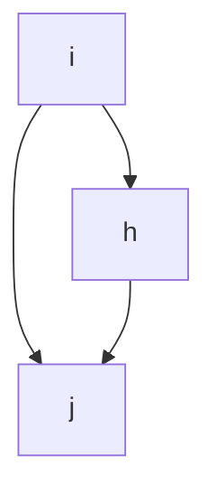

## 模型基本原理

### SAOM模型简介

SIENA(Simulation Investigation for Empirical Network Analysis)是一个统计工具,适用于分析纵向网络数据。其主要运用的是一种动态网络模型:**随机行动者导向模型**(Stochastic Actor-Oriented Model,SAOM)。为方便表述,我们通常将在SIENA中实现的SAOM称为“SIENA模型”。

SAOM模型的主要特点是其“行动者导向”的特性,意味着模型从行动者(即网络节点)的视角来模拟变化。在网络演化中,行动者可能建立、维持或终止与其他行动者的关系。研究者通常假设,行动者的这些决策会受到网络本身的结构、行动者自身以及网络中其他行动者的特性和行为的影响。SAOM模型为我们提供了一种手段,可以量化这些因素在不同观测时期的网络演化中所起的作用及其相关的不确定性。

SAOM模型可以被视为一个基于行动者的网络演化仿真模型。在该模型中,相邻时点的变化被称为“最小步骤”,一个行动者可以创建或终止一个外向的关系。这些最小步骤是依序并且基于概率进行的。通过大量的这样的最小步骤,我们可以观察到从一个时间点到另一个时间点的网络演化。行动者的决策将受到当前网络状态的影响,且每一次最小步骤的发生都可能改变网络的状态。这种机制使得模型能够反映出网络动态中典型的反馈过程。

尽管SIENA模型是行动者导向的,但并不意味着行动者需要在任何实际意义上做出决策。这只是意味着网络的变化是由网络中的节点来驱动的。SAOM模型的主要目标是帮助研究者通过探索个体、环境和社会因素在网络变化中的相对重要性,以进一步发展他们的行动理论。虽然SAOM模型无法解决所有的因果问题,但是,由于其纵向设计,SAOM模型在处理一些与因果关系相关的问题上可能提供一定的帮助。

### SAOM模型类型

SIENA不仅可以分析单一网络的演化,而且有多种随机行动者导向模型的变体,适用于更复杂的数据结构。这些选项的可用性取决于研究问题以及可用数据的数量和类型。本部分将简要讨论当前已实现的模型类型,以帮助研究者确定他们能够利用随机行动者导向模型进行哪种类型的分析。

适合使用RSiena进行分析的最小数据集包括在同一节点集上定义的单个网络的两次观察。在这种情况下,我们能够测试网络结构如何促进其自身的演化。然而,根据可用的数据,可能适用更多的建模选项。目前已实现的随机行动者导向模型适用于以下分析:

1. **单模网络的演化**:分析有向或无向单模网络的演化,例如一个班级中的友谊网络(Snijders, 2001)。

2. **双模网络的演化**:分析双模网络的演化,例如一个班级中的社团成员关系:第一模式是由学生组成,第二模式是由社团组成(Koskinen和Edling, 2012)。

3. **个体行为的演化**:分析个体行为(如吸烟)的演化。

4. **单模网络、双模网络和个体行为的共演化**:分析单模网络、双模网络和个体行为的共同演化,例如友谊和吸烟,或友谊和社团成员关系的共同演化(Steglich et al., 2010; Snijders et al., 2013)。

在所有这些情况下,数据也可以包括协变量:影响动态的观察变量,但其值本身不被建模。

在前两种情况下,可以使用RSiena评估给定单模或双模网络的变化在多大程度上取决于网络结构本身和协变量。第三种选项,即模拟个体行为本身的变化,而不考虑其在网络中的嵌入性,使用较少。对于这类数据,存在许多其他的纵向建模技术。

因此,第四种模型类型已广泛应用。分析网络和行为的共同演化允许研究者解决与选择和影响过程相关的问题,例如,是否吸烟者倾向于成为朋友,或者朋友是否倾向于在吸烟习惯上变得相似。SIENA共演化模型的强大之处在于,可以同时考虑网络结构对网络演化、行为实际水平对行为变化、网络结构对行为变化、以及行为实际水平对网络演化的影响。除了网络和行为的共演化,这类随机行动者导向模型还允许对多个网络(例如友谊和建议,友谊和不喜欢,或者它们三者)的联合分析,以及有序多网络(一个网络中的联系假设另一个网络中的联系存在,例如在友谊和最好的朋友关系中)的分析。

## 研究工具准备

在进行SAOM(Stochastic Actor-Oriented Models)模型研究之前,需要设置好R环境并安装RSiena库。RSiena是一个在R环境中运行的软件包,专门用于分析SAOM模型。

```R
# 安装RSiena
install.packages("RSiena") 

# 加载RSiena库
library(RSiena)
```

## 数据准备

在使用SAOM模型前,需要把数据准备成适用于R的格式。以下是一些基本的R函数:

```R
# 读取文件中的数据为数据框
df <- read.table(file, header = TRUE, sep = ",")  

# 将数据框转换为矩阵
matrix <- as.matrix(df)

# 检查对象的类别
class(object)

# 检查矩阵维度
dim(matrix)
```

### 网络要求

SAOM模型中对于网络主要有以下基本要求:

- **二值网络**:SAOM模型适用于二值网络,即网络连接状态为存在(1)或不存在(0)的网络。

- **至少两期**:使用SAOM模型至少需要两个时间点的观察数据。

数据集中可以包含一个或多个网络。网络可以是单模的或双模的。模态是用节点集标识的。所有单模网络必须具有相同的节点集,也称为“行动者”。如果存在一些单模网络和任何双模网络,则所有双模网络的第一个节点集应该是单模网络的节点集(行动者集)。单模网络和双模网络的选择是通过`sienaDependent()`函数中的`type`参数指定的,对于网络可以设置为`oneMode`或`bipartite`;后者表示双模网络。如果同时存在单模网络和双模依赖网络,则应该首先在`sienaDependent()`调用中指定单模网络。

通过`sienaDependent()`进行数据规范时,必须将网络指定为矩阵、数组或稀疏矩阵三元组列表的形式。`sienaDependent()`的帮助页面有使用稀疏矩阵作为输入的示例。

对于通过`sienaDataCreateFromSession()`函数规范的数据,也允许使用边列表格式。这可以是Pajek程序格式,也可以是所谓的Siena格式的原始边列表。对于节点数量较多(比如大于100)的网络,边列表格式在计算机内存使用上更高效。

请注意,`sienaDataCreateFromSession()`仅在RSienaTest中可用。

与Pajek或Siena格式相比,稀疏矩阵(可通过`sienaDependent`输入使用)对于运行估计具有相同的效率。三种可能的网络输入格式如下:

1. **邻接矩阵**

   这些可以在`sienaDependent`和`sienaDataCreateFromSession`中使用。

   在常规的单模网络情况下,邻接矩阵以`n`行和`n`列的矩阵形式给出,包含整数。对角线的值无意义,但必须存在。在双模网络(即具有两个节点集的网络,所有关系在第一个和第二个节点集之间)的情况下,矩阵不必是正方形的,因为第一个集合中的节点数通常不会等于第二个集合中的节点数;而且如果矩阵是正方形的,对角线仍然是有意义的。

   尽管本节只讨论有向图,但对于单模网络,如果所有观察到的邻接矩阵都是对称的,也可以指定无向网络。这将由SIENA自动检测,然后程序将采用非定向网络的方法。

   关系的值必须为0、1或NA(不可用=缺失);或者是预设值10或11(见下文)。

   `sienaDependent`的帮助页面通过示例展示了如何使用稀疏矩阵进行规范。

2. **Pajek格式**

   这些可以在`sienaDataCreateFromSession`中使用(仅在RSienaTest中可用)。

   如果有向图数据文件的扩展名是`.net`,则程序假定数据文件具有Pajek格式。文件应该只与一个观察相关,并且应该包含一个顶点列表(使用关键字`*Vertices`,以及一个弧列表,使用关键字`*Arcs`后面跟随按Pajek规则的数据行。这些关键词必须在不包含其他字符的行中。`s50`数据集的`examples`目录中分发的示例输入文件演示了这种格式。

3. **Siena格式**

   这些可以在`sienaDataCreateFromSession`中使用(仅在RSienaTest中可用)。

   边列表是一个包含三列或四列的矩阵:起点、终点、权重、波次(可选)。

   与Pajek格式一样,这种格式的优点是不存在的关系(权重为0的关系)不需要在数据矩阵中提及。通过在Siena格式的第四列中指定波次,可以使用一个矩阵包含所有波次的数据。

   缺失值必须以R中常用的方式表示,即NA。

## 变量设定

### 因变量设定

#### 网络因变量设定

|        t1         |        t2         |                           |
| :---------------: | :---------------: | :-----------------------: |
| i &nbsp; &nbsp; j |      i -> j       |     creation of a tie     |
|      i -> j       |      i -> j       |   maintenance of a tie    |
|      i -> j       | i &nbsp; &nbsp; j |   termination of a tie    |
| i &nbsp; &nbsp; j | i &nbsp; &nbsp; j | maintenance of a ‘no-tie’ |


对于一个二值网络的两次观测，单个网络连接变量可以有四种模式，如上表所示。在SAOM模型中,连结的变化被定义为三种方式:

- 创建(creation):建立先前不存在的连结
- 维持(endowment):维持现有连结 
- 评估(evaluation):不区分创建或维持,仅评估连结的存在

这三个可能的连结变化值构成了网络演化模型的因变量（除此之外，还有速率函数）。模型化创建、维持或存在网络连结的概率（更准确地说，它们是对数概率的线性预测器的组成部分）作为因变量，构成不同的效应（effect）。下表可以帮助理解每种情况下概率是如何参照的：比较绿色情况的概率和蓝色情况的概率。


它们通过三个函数在RSiena中进行建模:

```R
# 评估函数 
my_model <- setEffect(my_model, effectName = "evaluation", ...) 

# 创建函数
my_model <- setEffect(my_model, effectName = "creation", ...)

# 维持函数
my_model <- setEffect(my_model, effectName = "endowment", ...)  
```
这些函数取决于行为者以及网络、行为和协变量的状态由某些效应的加权和构成，这些效应定义了决定网络和行为的变化概率特征。

* **速率函数**:速率函数模型化了因变量改变的速度，即每个网络行为者获得改变其因变量得分机会的速度。

* **评估函数**:评估函数是变化概率的主要决定因素。向评估函数值更高的状态移动的概率更高。另外一种表示方法是,评估函数建模行为者对其局部网络邻域配置的“满意度”。即假设行为者改变其因变量得分,使其总体满意度提高——带有一个随机元素来表示行为的有限可预测性。

- **创造函数**:创造函数在评估可能的网络变化时区分新老网络关系，在评估可能的行为变化时区分增加或减少行为值。它仅对向上变化的概率是变化的组成部分：关系的创建，也就是行为因变量值的增大。创造效应可以是评估效应的创造部分，也可以是基本效应。

  使用满意度的解释方法,创造函数建模创造网络关系或增加行为得分时产生的满意度增加。

- **禀赋或维持函数**:禀赋函数,也可称为维持函数,在评估可能的网络变化时也区分新老网络关系，在评估可能的行为变化时区分增加或减少行为值。

  它也仅对向下变化的概率是变化的组成部分:现有关系的维持与终止,行为变量值的减少。

  同样,禀赋效应可以是评估效应的维持部分,也可以是基本效应。

  使用满意度的解释方法,禀赋函数对解散网络关系或减少行为得分时导致的满意度损失进行建模(因此使用“禀赋”这个标签)。

创造、评估和禀赋效应可以作为一个模型中出现一个或两个作为模型函数的组成部分，但不能所有三个中都出现再一个模型函数中（这将导致完全共线）。每个效应的估计参数应被解释为对数概率比（类似于来自逻辑回归的对数优势比；因为这里的选择是多项的而不是二元的，所以正确的术语是概率比）。从实践的角度看，除非人们对分析的数据集中的连接创建和维持可能怎样有一个清晰的想法，否则开始建模时使用评估效应是更便利的。如果一个给定的效应对连结的创建和维持同样强烈，将一个效应的贡献分解为两个函数需要更多的数据，那么统计效力将由于这种分解而减小。出于这些原因，大多数研究将他们的注意力放在在评估效应上。然而，如果有足够的数据，连接的创建和维持之间的区别可以产生不同角度的解释观点。

### 协变量设定

SAOM模型允许加入不同类型的协变量来控制网络或行为变化中的其他因素。协变量是影响网络或行为动态但本身不被建模的观察变量。协变量可以是一元或二元,不变或变化的：

* 一元协变量vs二元协变量:一元协变量描述行动者的特征,二元协变量描述行动者对之间的关系。
* 不变协变量vs变化协变量:不变协变量在观测时期保持恒定,变化协变量在不同观测时期发生变化。
* 网络协变量:描述整个网络拓扑结构性质的协变量,例如网络密度、平均路径长度等。

通过加入不同类型的协变量,研究者可以区分网络结构效应和协变量效应对网络或行为变化的影响,得到更准确的模型结果。

#### 行为体绑定协变量

行为体绑定变量(也称为一元协变量)是通过`coCovar()`函数(如果它们随时间常量)和`varCovar()`函数(如果它们随时间变化)定义的。

每个恒定的行为体绑定协变量对所有观察时刻都有每个行动者一个值,并且具有自变量的作用。

变化的变量可以在观测时刻之间改变;这时它们称为“变化的行为体绑定协变量”,也具有自变量的作用。

SIENA的内部操作不依赖于变量的量表。建议对协变量进行缩放,使其标准偏差在0.1到10之间。

变化的行为体绑定协变量被假定在两个观察之间保持不变的值。如果网络的观测时刻为$t_1、t_2、...、t_M$,则变化的协变量参考$M-1$个时刻$t_1$至$t_{M-1}$,并且变化协变量的第$m$个值被假定在时刻$t_m$到$t_{m+1}$期间有效。$t_M$时刻(最后时刻)的价值不起作用。只有在存在3个或更多观测时刻的情况下,变化的协变量作为自变量才有意义,因为对于2个观测时刻,恒定和变化的协变量的区别没有意义。

每个变化的行为体绑定协变量必须在对`varCovar()`的单独调用中指定,使用$n\times (M-1)$矩阵作为输入,其中列对应于$M-1$个观测之间的时期。

默认情况下,均值从协变量中减去。这可以通过构造带有关键字`centered=FALSE`的协变量来关闭。中心化协变量改进了估计算法的收敛性。因此,建议使用默认值(中心化),除非有理由使用非中心化协变量,例如在效应中用作权重(例如,对于inPopX效应)。可以将给定的行动者变量以中心化和非中心化版本的协变量包含在SIENA数据集中。请参阅关于中心化的4.2.2节。

#### 二元协变量

与网络数据一样,每个二元协变量的测量也必须包含在单独的矩阵中。对于单模数据,这是一个正方形的数据矩阵,对角线值无意义。

区分恒定和变化的二元协变量,其中变化指随时间变化。每个恒定的协变量对每个行动者对都有一个对所有观察时刻均有效的值,并且具有自变量的作用。另一方面,变化的协变量在观测之间的每个时期都有这样一个值。如果网络数据有$M$个波次(即观察时刻),则这涵盖了$M-1$个时期,因此,为指定单个变化的单模二元协变量,需要$n \times n \times (M-1)$的数组。

双模二元协变量也是可能的;请参阅`coDyadCovar`和`varDyadCovar`的帮助页面。

SIENA的内部操作不依赖于量表。建议对协变量进行缩放,使其标准偏差在0.1到10之间。

与单体协变量一样,假定变化的二元协变量在两个观察时刻之间保持常数值。如果网络的观测时刻为$t_1、t_2、...、t_M$,则变化的协变量参考$M-1$时刻$t_1$至$t_{M-1}$,并且变化协变量的第$m$个值被假定在时刻$t_m$到$t_{m+1}$期间有效。$t_M$时刻(最后时刻)的值不起作用。

使用`coDyadCovar`函数指定恒定二元协变量,使用`varDyadCovar`指定变化的二元协变量。

#### 协变量的内部处理

##### 协变量的交互作用和二元变换

对于行为体绑定变量(也称为单体变量),SIENA内部通过相应效应的定义将其转化为两种二元协变量。设行为体绑定变量为$v_i$,二元组中的两个行为体为$i$ 和 $j$。假设$v_i$ 的范围(即最高值和最低值的差值)给定为$r_V$。两种变换如下:

1. 二元相似度定义为:

   $$sim_{ij}^V = 1 - \frac{|v_i - v_j|}{r_V}$$

   如果两个行为体具有相同的值,则此相似度测量为1;如果一个具有最高可能值,另一个具有最低可能值,则为0。对于各种相似性效应,此测量通过减去所有二元组的均值进行中心化,因此此相似性变量的均值变为0。

   此相似度测量的优点是其系数在某种意义上是可比较的,即测量总是在0和1之间变化。

2. 相同的$V$定义为:

   $$same_{ij}^V = \begin{cases}
            1, & \text{if } v_i = v_j\\
            0, & \text{if } v_i \neq v_j
          \end{cases}$$
          
   这也可以称为相对于$V$的二元同一性。

二元相似度适用于可以视为区间级变量的协变量;二元同一性适用于分类变量。

此外,SIENA提供了用户自定义的协变量之间的两变量和三变量交互的可能性。

##### 中心化(去均值)

行为体绑定变量和二元协变量都可以通过程序以下方式中心化。

对于行为体绑定变量,均值由`sienaDataCreate`函数减去。然后存储中心化的值,所有计算都使用这些中心化变量。对于变化的变量,使用的均值是全局均值(在所有时期上平均)。这些被减去的均值在`print01Report`的输出中报告。对于多组选项(第11.2节),被减去的值是所有组的全局均值。

中心化是默认设置。可以通过在调用`coCovar`、`varCovar`、`coDyadCovar`或`varDyadCovar`时分别指定`centered=FALSE`来关闭协变量的中心化。建议使用默认设置(中心化),除非有理由使用非中心化协变量,例如在效应中用作权重(如对`inPopX`效应)。如果某个行为体变量要用作非中心化协变量,建议将其以中心化和非中心化的版本都包含在SIENA数据集中,并仅在需要适当的效应定义时使用非中心化版本。

对于二元协变量和从行为体绑定变量派生的相似性变量,`sienaDataCreate`函数计算并存储全部均值;存储的变量值不中心化,但在程序计算期间从中减去均值。 (因此,与行为体绑定变量不同,程序内部以不同方式处理二元协变量,意味着在不同时刻减去均值,但效果相同;多组数据集除外,参见下文。) 与“协变量相似性”效应不同,“相同协变量”效应不中心化,而保持其0-1值。

对于多组选项(第11.2节),二元协变量与行为体绑定变量的处理不同:在多组数据集的二元协变量中,中心化是通过组内均值完成的;多组数据集的行为体绑定变量通过`sienaGroupCreate`中心化于总体均值。

对于依赖行为变量,第12.2节中定义的效应是中心化变量的函数。

协变量的均值存储为`sienaDataCreate`创建的对象的属性。可以通过对象查看均值信息。

依赖行为变量的中心化在内部模拟期间完成,其均值不存储在SIENA数据集中,但存储在依赖变量的属性中。可以通过相关函数计算依赖变量的均值。

对于由`sienaGroupCreate`构造的多组数据集,属性“vCovarMean”包含行为体绑定变量的总体均值。

此外,`sienaComposition()`处理组合变化,`sienaDataCreate()`组合各数据源,`sienaGroupCreate()`定义群组结构。

## 进一步的数据规范

###  结构决定值

允许图中的某些值是结构决定的,即确定性的而不是随机的。这与列联表中“结构零”的现象类似,但在SIENA中不仅允许结构零,还允许结构一。

结构零和结构一可以在输入数据中分别使用预留代码10和11指定。它们可以在不同时间点有所不同。

结构零提供了一种简单的方法来处理行为体在观测之间加入或离开网络的情况:在行为体不在场时,将其所有入度和出度关系变量指定为结构零。

当模型中包括了赋值或创建效应时,不应该使用变化的结构值。

### 缺失数据

SIENA允许网络变量、协变量和依赖行为变量存在缺失数据,用NA表示。

缺失数据被视为非信息性的。缺失数据比例低于10%的情况下通常不会造成太多困难,前提是缺失是非信息性的。

为了进行有意义的模拟,缺失值会被填充。在参数估计中,含有缺失的关系变量和行为体变量不会用于计算目标统计量。

- 在初始观测中,缺失条目被设置为0(无关系)。

- 在后续观测中,如果存在上一观测值则沿用,否则填充为0。 

- 对于协变量,默认用变量的全局均值填充。

- 填充值在模拟中可以改变。

- 统计量仅使用非缺失数据。

### 结构变化:加入者和离开者

行为体因加入或离开导致的网络结构变化是通过Huisman和Snijders (2003)的“加入者和离开者”方法处理的。

数据矩阵必须包含所有时点存在的行为体。对于行为体不在场的波次:

- 邻接矩阵条目可以是NA(视为0或上一值)或有效代码。

- 加入/离开时间由`sienaCompositionChange`或`sienaCompositionChangeFromFile`指定。

```R
# 示例
comp <- rep(list(c(1,6)), 50)
comp[[11]] <- c(3,6)  
comp[[20]] <- c(1,4)
comp[[33]] <- c(1.5,3, 4.01,6) 
changes <- sienaCompositionChange(comp)
```

- 需要无条件估计。

- 不能与`sienaGOF`联合使用。

- 使用NA代码使`sienaGOF`起作用。 

- 与赋值/创建效应不兼容;应使用本方法而非结构零。

## 模型设定

定义数据之后,下一步是模型的设定，涉及选择影响网络和行为变化的效应。

并非所有变化概率的贡献都可以写成某些基本函数（评估函数）的变化。因此，有时我们需要直接表示对关系变化或行为变化的贡献，而不借助评估函数，这通过使用基础效应来实现。(Snijders, 2001中称之为满意函数；作为更中性的术语,我们现在使用“基础效应”一词。)

### 基础效应

以传递闭包为例，它可以表示为行动者倾向于形成封闭三元组，如下图所示。当我们聚焦于行动者i时，如果上一个时点已经具有了i -> j和h -> j的连结，那么这个时点行动者i就可能更倾向于与行为者h形成连结（h对第三个行为者j作出相同的出度选择）。这个过程中，对应的评估效应是趋向于形成封闭三元组的transTrip效应,它由两个不同的基础效应transTrip1(促进创建或维护i -> j连结)和transTrip2(促进i -> h连结)组成。



基础效应是直接定义的，不需要基于某个评估函数的变化进行表述。这意味着基础效应比评估效应更为普遍，所有的效应都可以被表示为基础效应。然而，为了方便理解，我们尽可能的使用评估函数来表述效应。

基础效应可以适用于关系的创建和维护，也可以只适用于关系的创建或者维护。在RSiena中,基本效应和评估效应之间的区别仅在于内部编程代码,effects对象中指定的效应类型以及includeEffects和setEffect等函数中的可能取值仅为eval、creat和endow。在RSiena这个软件中，基础效应和评估效应的区别主要在于内部编程代码，而效应的类型可能是eval（评估）、creat（创建）和endow（维护）。

在SAOM模型中，每个效应都对应一个指标(statistic)，这个指标测量了某个特定网络配置的存在程度。每个效应的值都是根据这个指标和一个参数(也就是系数)的乘积来计算的。

### *数学规范

以下给出了模型的数学定义以准确解释上述直观说明。为了简化记号，我们从公式中省略了所有的统计参数。为了保持本节的简洁，我们不会给出大量的解释，而是引用相关文献。

根据Snijders等人（2010b）的解释，这个模型是一个连续时间马尔可夫链，表示了网络（以及行为）如何在微小步骤（所谓的最小步骤）中从一个观察值变化到另一个观察值。每一个最小步骤都只涉及到一个联系值或一个行为变量的改变，模型如下。

首先考虑网络动态。在任何给定的时刻，设网络被表示为 $x_0$。行动者 $i$ 的速率函数表示为 $\lambda_i(x)$；评价函数表示为 $f_i(x)$；创建函数表示为 $c_i(x)$；禀赋函数表示为 $e_i(x)$。

在任何给定的时刻，设当前网络表示为 $x_0$。改变的下一个机会出现的时间长度以参数 $\lambda^+(x_0) = \sum_i \lambda_i(x_0)$ 指数分布。这意味着期望的时间长度为 $\frac{1}{\lambda^+(x_0)}$。行动者 $i$ 成为下一个有改变机会的可能性是 $\frac{\lambda_i(x_0)}{\lambda^+(x_0)}$。

假设行动者 $i$ 是下一个有改变机会的人，也可以说，这是关注的行动者。然后行动者 $i$ 有改变一个网络联系或保持网络状态不变的可能性。用 $C$ 表示所有可以作为结果获得的网络集合。然后这一步得到的网络的概率取决于称为目标函数的 $u_i(x_0, x)$，稍后我们将定义这个函数。假设 $x \in C$ 是可以作为最小步骤结果获得的某个网络；那么 $x$ 将与 $x_0$ 相同，除了可能存在于 $x$ 但不存在于 $x_0$ 的联系 $i \rightarrow j$，反之亦然。下一个网络是 $x$ 的概率由下式给出：

$$
\frac{exp(u_i(x_0, x))}{\sum_{x'\in C} exp(u_i(x_0, x'))}
$$

分子是为了让这一步的所有概率之和为1。

目标函数定义如下。如果只有评价函数（数学上，这意味着创建函数和禀赋函数都为0），那么目标函数等于新状态的评价函数，$u_i(x_0, x) = f_i(x)$。由于指数函数的特性，我们同样可以将目标函数定义为评价函数的增益，$u_i(x_0, x) = f_i(x) - f_i(x_0)$。

定义一般情况时，注意如果 $x_0$ 和 $x$ 不同，那么它们只在一个联系变量 $x_{ij}$ 上不同。定义 $\Delta^+(x_0, x) = 1$ 如果 $x$ 的联系比 $x_0$ 多一个，意味着这个改变创建了一个联系，否则 $\Delta^+(x_0, x) = 0$。类似地，定义 $\Delta^-(x_0, x) = 1$ 如果 $x$ 的联系比 $x_0$ 少一个，意味着这个改变解除了一个联系，否则 $\Delta^-(x_0, x) = 0$。然后目标函数的一般定义是：

$$
u_i(x_0, x) = f_i(x) - f_i(x_0) + \Delta^+(x_0, x)(c_i(x) - c_i(x_0)) + \Delta^-(x_0, x)(e_i(x) - e_i(x_0))
$$

这表明，如果创建了一个联系（$\Delta^+(x_0, x) = 1$），创建函数的改变才起作用；如果解除了一个联系（$\Delta^-(x_0, x) = 1$），禀赋函数的改变才起作用。

如果也包括基本效应，那么将一般的（评价类型）基本效应的线性组合表示为 $f_{el_{ij}}(x)$，创建基本效应表示为 $c_{el_{ij}}(x)$，禀赋基本效应表示为 $e_{el_{ij}}(x)$。然后我们还需要将 $f_{el_{ij}}(x) + \Delta^+(x_0, x) c_{el_{ij}}(x) + \Delta^-(x_0, x) e_{el_{ij}}(x)$ 加到目标函数 $u_i(x_0, x)$ 中。

对于行为动态，定义与之相似。这里的基本假设是，当有改变的机会时，行为变量的可能新值是当前值，当前值+1，或当前值-1，只要这些改变不会使值超出允许的范围。更详细的解释参见 (Snijders et al., 2007, 2010b; Steglich et al., 2010; Veenstra et al., 2013)。

评价函数、创建函数和禀赋函数都是由效应的线性组合构造的：
$$
f_i(x) = \sum_k \beta_k s_{ik}(x)
$$
其中，$\beta_k$ 是参数，$s_{ik}(x)$ 是效应。对于具有多个因变量（网络、行为）的模型，这是特定于每个因变量的；例如，在一个既包含网络又包含行为的研究中，有一个网络和一个行为变量时，就会有两个评价函数。

对于网络效应，公式 (4) 所表示的关键是差值：
$$
\Delta_{kij}(x) = s_{ki}(x + _{ij}) - s_{ki}(x - _{ij})
$$
其中，$x + _{ij}$ 是包含连结 $i \rightarrow j$ 的网络 $x$，$x - _{ij}$ 是去除该连结的网络 $x$。这被称为变化统计量。

基本效应定义为：
$$
s_{el_{ijk}}(x) = x_{ij} s_{el_{ijk}^0}(x)
$$
对于一个不依赖于 $x_{ij}$ 的统计量 $s_{el_{ijk}^0}(x)$。因此，相应的变化统计量是：
$$
\Delta_{el_{kij}}(x) = s_{el_{ijk}^0}(x)
$$
这个公式阐述了，在给定的网络状态 $x$ 下，改变某个特定的联系 $i \rightarrow j$ 将会如何改变基本效应。

### 简要数学规范

对于总的网络效应（将不同的网络结构指标作为因变量）,根据以下公式计算:
$$
f^{\text{net}}_i(x) = \sum_{k} \beta^{\text{net}}_k s^{\text{net}}_{\text{ik}}(x)
$$

其中,$f^{\text{net}}_i(x)$ 是行动者 $i$ 的网络效应函数,$\beta^{\text{net}}_k$ 是效应 $k$ 的参数,$s^{\text{net}}_{\text{ik}}(x)$ 是效应 $k$ 的指标。参数 $\beta^{\text{net}}_k$ 是模型的一部分,需要通过模型估计来确定。而指标 $s^{\text{net}}_{\text{ik}}(x)$ 则是根据网络数据 $x$ 来计算的。

对于行为效应（将行动者的不同行为指标作为因变量）,公式如下:
$$
f^{\text{beh}}_i(x, z) = \sum_{k} \beta^{\text{beh}}_k s^{\text{beh}}_{\text{ik}}(x, z)
$$

其中,$f^{\text{beh}}_i(x, z)$ 是行动者 $i$ 的行为效应函数,$\beta^{\text{beh}}_k$ 是效应 $k$ 的参数,$s^{\text{beh}}_{\text{ik}}(x, z)$ 是效应 $k$ 的指标。参数 $\beta^{\text{beh}}_k$ 是模型的一部分,需要通过模型估计来确定。而指标 $s^{\text{beh}}_{\text{ik}}(x, z)$ 则是根据网络数据 $x$ 和行为数据 $z$ 来计算的。

每个效应的参数通过模型估计来确定，具体来说，参数估计的目标是最大化观察数据的对数似然（可以选择其他的估计方法）。对于单个连结变化的对数概率,可以通过以下公式表示:
$$
f_{\text{ij}}(\beta, s) = \sum_{k=1}^K \beta_k s_{\text{kij}} + \epsilon_{\text{ij}}
$$

其中,$f_{\text{ij}}(\beta, s)$ 是连结 $i \rightarrow j$ 的对数概率,$\beta_k$ 是效应 $k$ 的参数,$s_{\text{kij}}$ 是效应 $k$ 的指标,$\epsilon_{\text{ij}}$ 是一个误差项。

对于行动者 $i$ 选择行动者 $j$ 作为网络连结的概率,则可以通过以下公式表示:
$$
Pr_{ij} = \dfrac{exp\left(\sum_{k=1}^K \beta_k s_{kij}\right)}{\sum_{h=1}^J exp\left(\sum_{k=1}^K \beta_k s_{kih}\right)}
$$

其中,$Pr_{ij}$ 是行动者 $i$ 选择行动者 $j$ 的概率,$\beta_k$ 是效应 $k$ 的参数,$s_{\text{kij}}$ 是效应 $k$ 的指标。参数 $\beta_k$ 是模型的一部分,需要通过模型估计来确定。

这些公式提供了一个框架,可以在这个框架中定义和计算各种网络和行为效应。具体的效应和指标的选择取决于研究的目标和问题。

### 效应设定

在*RSiena*中，我们使用效应对象来定义模型的数据规范。一般而言，效应对象是一个属于`sienaEffects`类的对象，在处理多组模型的情况下（稍后我们会讨论这个主题），它属于`sienaGroupEffects`类。它其实是一种特殊类型的数据框架。函数`getEffects`最初创建了效应对象，然后我们可以使用函数`includeEffects`、`setEffects`等来修改效应对象。其中一个关键组成部分是每个效应的`shortName`，这是数据框架中的一列，用于标识效应。在实际使用SIENA时，`shortNames`极为重要。

`shortName`本身并未指定协变量，因此除了需要`shortName`，效应的协变量（以及其他作为效应的解释变量的因变量）还需要协变量的名称。如果有多个因变量（网络和/或行为变量），则指定效应还需要因变量的名称(`name`)，这将在效应对象的`interaction1`(等)列中给出。

我们可以通过效应的`type`来指定评估效应（`eval`）、禀赋效应（`endow`）和创造效应（`creation`），其默认值是`eval`。对于速率效应，其类型为`rate`，我们可以在函数`includeEffects`、`setEffect`和`includeInteraction`中设置类型。

你可以使用`effectsDocumentation()`函数在浏览器中显示当前版本RSiena中所有可用效应的列表及其shortNames。

例如，给定效应对象（例如`myeff`）的所有可用效应的列表可以通过下列函数调用在浏览器中显示：

```R
effectsDocumentation(myeff)
```

若要列出`myeff`对象中的前20个效应，可以运行：

```R 
head(cbind(myeff$effectName, myeff$type, myeff$shortName), 20)
```

作为另一个例子，要列出`myeff`中的所有评估效应，可以运行：

```R
cbind(myeff$effectName, myeff$type, myeff$shortName)[myeff$type == "eval",]
```

而要获取`myeff`中的所有`shortNames`集合，可以运行：

```R
unique(myeff$shortName)
```

简单来说，选择影响网络和行为变化的效应需要以下三个步骤:

1. **选择效应**

   使用`getEffects()`可以查看RSiena支持的所有内置效应。
   
   使用`includeEffects()`可以选择加入模型的效应。`includeEffects()`主要参数:
   
   - `sienaModel`:SIENA模型对象
   
   - `effectsToInclude`:字符向量,指定效应名称
   
   - `behaviors`:是否为行为效应,默认FALSE
   
   - `layers`:用于选择层次效应的层
   
   - `period`:用于选择不同时期的效应
   
   - `formation` :用于选择网络形成效应
   
   - `rate`:用于选择率效应
   
   - `maxAlter`:最大选择边数,用于截断效应

   示例:

   ```R
   # 为my_model选择两个网络效应  
   my_model <- includeEffects(my_model, effectsToInclude=c("outDegree","reciprocity"))
   
   # 为my_model选择三个行为效应
   my_model <- includeEffects(my_model, effectsToInclude=c("linearShape","quadraticShape","interaction"), behaviors=TRUE)
   ```

2. **设置效应参数**

   使用`setEffect()`可以修改或添加效应的参数。`setEffect()`主要参数:
   
   - `sienaModel`:SIENA模型对象
   
   - `effectName`:效应名称  
   
   - `behavior`:是否为行为效应,默认FALSE  
   
   - `parameters`:数字向量,设置效应参数
   
   - `period`:设置特定时期的效应参数
   
   - `formation`:设置网络形成效应参数
   
   - `verbose`:是否打印详细信息

   示例:

   ```R   
   # 为"outDegree"网络效应设置参数0.2
   my_model <- setEffect(my_model, "outDegree", 0.2)   
   
   # 为"linearShape"行为效应设置参数1.5
   my_model <- setEffect(my_model, effectName="linearShape", behavior=TRUE, 1.5)
   ```

3. **添加交互效应**

   使用`includeInteraction()`在模型中加入交互效应。`includeInteraction()`主要参数:
   
   - `sienaModel`:SIENA模型对象
   
   - `interaction`:交互效应名称
   
   - `nestedIn`:交互效应嵌套的效应名称
   
   - `period`:添加特定时期的交互效应
   
   - `formation`:添加网络形成的交互效应

   示例:
   
   ```R
   # 添加两个网络效应的交互效应
   my_model <- includeInteraction(my_model, interaction="outDegree_X_reciprocity")
   
   # 添加一个行为效应的二次项
   my_model <- includeInteraction(my_model, interaction="quadraticShape", nestedIn="linearShape", behavior=TRUE)
   ```

## 模型估计

## 结果解读

## 其他话题：拟合优度

## 其他话题：估计方法的讨论

## 其他话题：共线性误差消除

## 